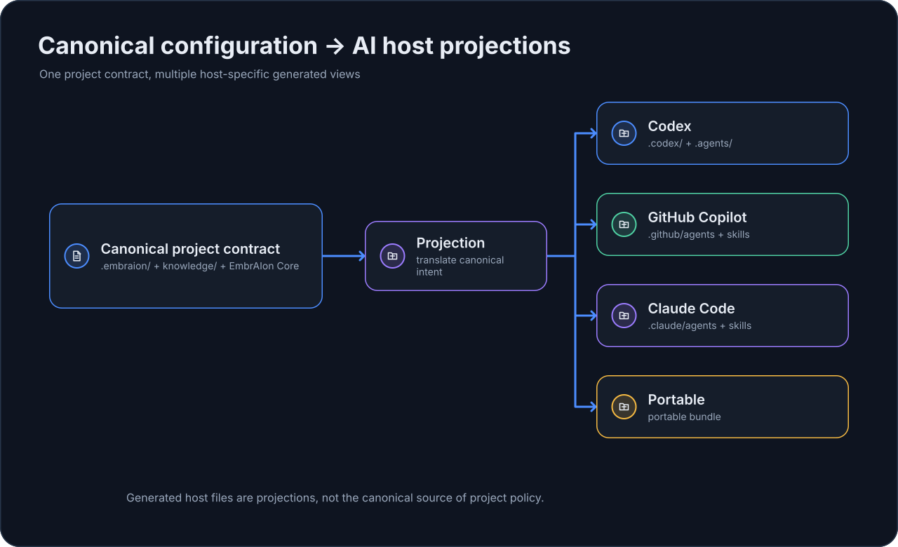

# Configure with Your AI Client

You do not have to hand-edit every `.embraion/` file. The AI client already working in the repository can help configure project-owned EmbrAIon settings, as long as it edits the canonical file for the requested concern and preserves safety boundaries.

This page focuses on conversational configuration patterns for Codex, GitHub Copilot, and Claude Code. For install locations and generated files, use the dedicated [AI Clients](../hosts/index.md) section.

EmbrAIon keeps the project configuration host-neutral where possible, then projects reusable agents and skills into the AI client you actually use.

The important ownership rule is:

{ loading=lazy }

You can use one host or several in the same repository.

## Codex

Install the Codex projection:

```bash
embraion install --host codex --destination .
```

Typical generated files include:

```text
.codex/
├── config.toml
└── agents/
    ├── analyst.toml
    ├── architect.toml
    ├── reviewer.toml
    └── ...

.agents/
└── skills/
    ├── implementation/
    ├── review/
    ├── routing-configuration/
    └── ...
```

If you want Codex to configure model routing for you, ask it in the repository:

> Configure EmbrAIon routing for this repository using only models and reasoning settings currently available to me in Codex. Keep host-default where an explicit override is unnecessary. Use the existing EmbrAIon route classes and role overrides. Write model, effort, or Codex-specific options only to `.embraion/routing.yaml` under `overrides.codex`. Do not change privacy, access, ownership, source protection, validation, or review rules to make a model fit. Verify the resulting routes with `embraion route`.

A resulting project override can look like:

```yaml
overrides:
  codex:
    routes:
      complex:
        model: "<Codex selector confirmed by Codex>"
        effort: "<Codex-supported effort>"
      critical:
        model: "<Codex selector confirmed by Codex>"
        effort: "<Codex-supported effort>"
    roles:
      reviewer:
        model: "<Codex selector confirmed by Codex>"
```

The values inside angle brackets are intentionally not owned by EmbrAIon. Codex should replace them with selectors actually available to the current account.

Verify a route:

```bash
embraion route \
  --host codex \
  --route-class complex \
  --data PRIVATE
```

For a reviewer-specific resolution:

```bash
embraion route \
  --host codex \
  --route-class substantial \
  --role reviewer \
  --data PRIVATE
```

If the repository already owns its Codex config, install only the EmbrAIon components you want:

```bash
embraion projection diff --host codex --destination . --component skills
embraion install --host codex --destination . --component skills
```

## GitHub Copilot

Install the Copilot projection:

```bash
embraion install --host copilot --destination .
```

Typical generated files include:

```text
.github/
├── agents/
│   ├── analyst.agent.md
│   ├── architect.agent.md
│   ├── reviewer.agent.md
│   └── ...
└── skills/
    ├── implementation/
    ├── review/
    ├── routing-configuration/
    └── ...
```

Ask Copilot to customize its EmbrAIon routing:

> Configure EmbrAIon routing for this repository using only model selectors and settings currently available to me in GitHub Copilot. Keep host-default unless there is a clear reason to override it. Write only to `.embraion/routing.yaml` under `overrides.copilot`. Do not weaken privacy, access, ownership, source protection, validation, or review policy. Verify any changed route with `embraion route`.

Example shape:

```yaml
overrides:
  copilot:
    routes:
      complex:
        model: "<Copilot selector confirmed by Copilot>"
    roles:
      reviewer:
        model: "<Copilot selector confirmed by Copilot>"
```

If Copilot exposes additional supported settings, they can be stored as `effort` or inside `options`; EmbrAIon treats those values as host-owned.

Verify:

```bash
embraion route \
  --host copilot \
  --route-class complex \
  --data PRIVATE
```

For selective adoption:

```bash
embraion projection diff --host copilot --destination . --component skills
embraion install --host copilot --destination . --component skills
```

## Claude Code

Install the Claude Code projection:

```bash
embraion install --host claude-code --destination .
```

Typical generated files include:

```text
.claude/
├── agents/
│   ├── analyst.md
│   ├── architect.md
│   ├── reviewer.md
│   └── ...
└── skills/
    ├── implementation/
    ├── review/
    ├── routing-configuration/
    └── ...
```

Ask Claude Code to configure its routing:

> Configure EmbrAIon routing for this repository using only models and settings currently available to me in Claude Code. Preserve host-default for routes that do not need an explicit selection. Write only to `.embraion/routing.yaml` under `overrides.claude-code`. Do not weaken privacy, access, ownership, source protection, validation, or review policy. Verify the changed routes with `embraion route`.

Example shape:

```yaml
overrides:
  claude-code:
    routes:
      complex:
        model: "<Claude Code selector confirmed by Claude Code>"
    roles:
      reviewer:
        model: "<Claude Code selector confirmed by Claude Code>"
```

Verify:

```bash
embraion route \
  --host claude-code \
  --route-class complex \
  --data PRIVATE
```

For selective adoption:

```bash
embraion projection diff --host claude-code --destination . --component skills
embraion install --host claude-code --destination . --component skills
```

## Configure more than model routing

The AI client can also help customize the rest of `.embraion/` as long as it edits the canonical file for the requested concern:

| User intent | Canonical file |
| --- | --- |
| Change project identity or capabilities metadata | `.embraion/project.yaml` |
| Register architecture/domain knowledge | `.embraion/knowledge.yaml` |
| Mark protected/canonical/generated/external paths | `.embraion/policy.yaml` |
| Change model routing | `.embraion/routing.yaml` |
| Add project validation commands | `.embraion/validation.yaml` |
| Declare project-specific agent IDs | `.embraion/agents.yaml` |

A useful general request is:

> Review this repository and configure its EmbrAIon project files for the current project. Keep each concern in its canonical `.embraion/` file, preserve existing framework safety gates, do not invent model selectors, and show which settings you changed and why.

After customization, inspect the result with:

```bash
embraion doctor
embraion policy show
embraion status
```

For model routing, also run `embraion route` for the routes or roles you changed.
