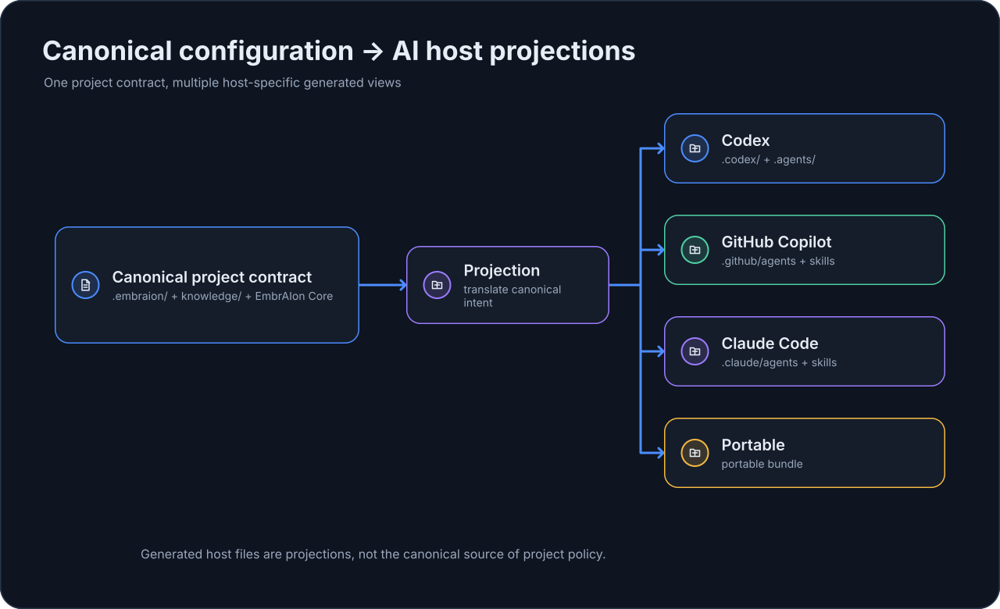

# Разговорная настройка проекта

Не обязательно вручную редактировать каждый файл в `.embraion/`. AI-клиент, уже работающий в репозитории, может помочь настроить project-owned settings EmbrAIon.

Эта страница про **изменение project contract через естественный язык**. Установка hosts, расположение generated files и host-specific ownership rules описаны в [AI-хостах](../hosts/index.md).

> EmbrAIon не перехватывает ваш prompt. Установленная host projection объясняет AI-клиенту, где находится каноническая конфигурация EmbrAIon и какие reusable roles/skills доступны.

## Обычная инженерная работа vs конфигурация

Обычная задача:

> Исправь retry behavior при ошибке соединения.

должна использовать существующий project contract.

Запрос на конфигурацию:

> Настрой routing так, чтобы bounded work использовала недорогие модели, complex architecture — более сильный reasoning, а critical route оставался только для исключительного риска.

должен намеренно изменить канонический project contract.

Host не должен переписывать `.embraion/` только потому, что вы попросили обычное продуктовое изменение.

## Канонический ownership

| Намерение пользователя | Канонический файл |
| --- | --- |
| Изменить identity проекта или capabilities metadata | `.embraion/project.yaml` |
| Зарегистрировать architecture/domain knowledge | `.embraion/knowledge.yaml` |
| Пометить protected/canonical/generated/external paths | `.embraion/policy.yaml` |
| Зарегистрировать reusable model/provider choices | `.embraion/deployments.yaml` |
| Изменить model routing | `.embraion/routing.yaml` |
| Добавить project validation commands | `.embraion/validation.yaml` |
| Объявить project-specific agents | `.embraion/agents.yaml` |
| Настроить optional provider execution bindings | `.embraion/execution.yaml` |
| Настроить optional pricing sources | `.embraion/pricing.yaml` |

Generated host files — это projections, а не второй configuration authority.

{ loading=lazy }

## Общий запрос на настройку

Полезный запрос:

> Изучи репозиторий и настрой его EmbrAIon project contract. Храни project facts в канонических `.embraion/` files, сохрани Core safety gates, не придумывай model selectors или secrets и объясни, какие settings изменил и почему.

После изменений:

```bash
embraion doctor
embraion policy show
embraion validation list
embraion status
```

Routing проверяйте через `embraion route`, generated host files — через `embraion projection diff`.

## Запрос на routing

> Настрой EmbrAIon routing для этого репозитория, используя только model selectors и reasoning settings, реально доступные этому host. Оставь host-default там, где явный override не нужен. Reusable concrete choices помести в `.embraion/deployments.yaml`, а route/role selection — в `.embraion/routing.yaml`. Не ослабляй privacy, access, ownership, validation или review policy.

## Запрос на knowledge

> Зарегистрируй текущие architecture и compatibility documents как EmbrAIon project knowledge. Используй Project Contract Slots там, где они соответствуют существующему source of truth. Не дублируй содержимое документов в YAML.

## Запрос на policy

> Проверь source ownership этого репозитория. Пометь first-party source как canonical, generated artifacts как generated, vendor-managed code как external или protected в зависимости от ownership, и сохрани все более строгие существующие ограничения.

## Запрос на validation

> Добавь deterministic project validation commands в подходящие EmbrAIon profiles. Fast должен быть дешёвым, affected — подходить для обычных изменений, full — оставаться широким project gate. Не считай пустой profile pass.

## Запрос на project agent

> Добавь project-specific read-only specialist для этого domain только если существующих Core roles недостаточно. По возможности наследуй совместимую Core role и не расширяй её access boundary.

## Host-specific setup

Используйте отдельные страницы:

- [Codex](../hosts/codex.md)
- [GitHub Copilot](../hosts/copilot.md)
- [Claude Code](../hosts/claude-code.md)
- [Portable bundle](../hosts/portable.md)
