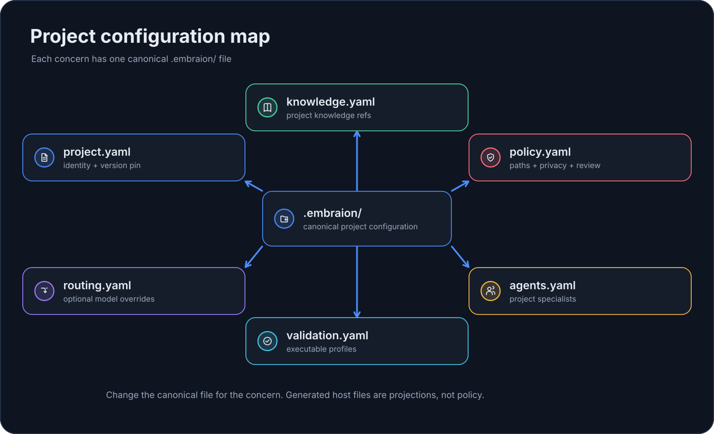

# Configure EmbrAIon for Your Project

After `embraion init`, your repository owns a small configuration surface under `.embraion/`.

The easiest way to understand it is by **question**, not by schema:

| Question | Canonical file |
| --- | --- |
| What project is this and which EmbrAIon release does it use? | `project.yaml` |
| What facts and architecture should the AI know? | `knowledge.yaml` |
| Which paths are canonical, protected, generated, or external? | `policy.yaml` |
| What privacy/review/enforcement rules apply? | `policy.yaml` |
| Should this project override the AI client's model selection? | `routing.yaml` |
| Which commands prove a change works? | `validation.yaml` |
| Does this project need domain-specific AI specialists? | `agents.yaml` |

{ loading=lazy }

## Project-owned layout

```text
.embraion/
├── .gitignore
├── project.yaml
├── knowledge.yaml
├── policy.yaml
├── routing.yaml
├── validation.yaml
└── agents.yaml
```

Runtime state may later appear under `.embraion/state/` and `.embraion/cache/`. Those directories are intentionally ignored by `.embraion/.gitignore`.

## Ownership rule

The consuming repository owns its `.embraion/` configuration and project/domain knowledge. Generated Codex, Copilot, Claude Code, and Portable files are projections of that canonical contract rather than a second place to express policy.

Project configuration may make local rules stricter, but it must not silently weaken reusable Core hard gates.

## Recommended order

Do not configure everything at once. A normal project usually benefits from this order:

1. **Identity** — confirm `project.yaml`.
2. **Knowledge** — register project and architecture truth.
3. **Policy** — classify source paths and choose privacy/review defaults.
4. **Validation** — add the commands that actually prove changes work.
5. **Host projection** — install the AI client(s) you use.
6. **Agents** — add project specialists only when Core roles are not enough.
7. **Routing** — leave host-default unless explicit model selection is useful.
8. **Enforcement** — enable only after policy and validation are trustworthy.

## Baseline configuration

### `project.yaml`

```yaml
framework:
  repository: GORYNED/EmbrAIon
  version: <pinned-version>

project:
  name: <project-name>

capabilities: {}
```

### `knowledge.yaml`

```yaml
{}
```

### `policy.yaml`

```yaml
sources:
  canonical: []
  protected: []
  generated: []
  external: []

review:
  substantial-required: true

privacy:
  default-class: PRIVATE

enforcement:
  enabled: false
  validation-profile: affected
  require-review: false
```

### `routing.yaml`

```yaml
overrides: {}
```

### `validation.yaml`

```yaml
profiles:
  fast: []
  affected: []
  full: []
```

### `agents.yaml`

```yaml
agents: []
```

## You can ask your AI client to configure it

Manual YAML editing is optional. A useful request is:

> Review this repository and configure its EmbrAIon project files. Keep project knowledge, policy, validation, agents, and routing in their canonical `.embraion/` files. Preserve existing safety boundaries, do not invent model selectors, and explain every change before applying it.

Then inspect:

```bash
embraion doctor
embraion policy show
embraion validation list
embraion status
```

## Continue by concern

- [Project knowledge](knowledge.md)
- [Policy & protected paths](policy.md)
- [Validation profiles](validation.md)
- [Project agents](agents.md)
- [Model routing](../model-routing.md)
- [Configure with your AI client](ai-hosts.md)
- [Full `.embraion/` file reference](project-files.md)
