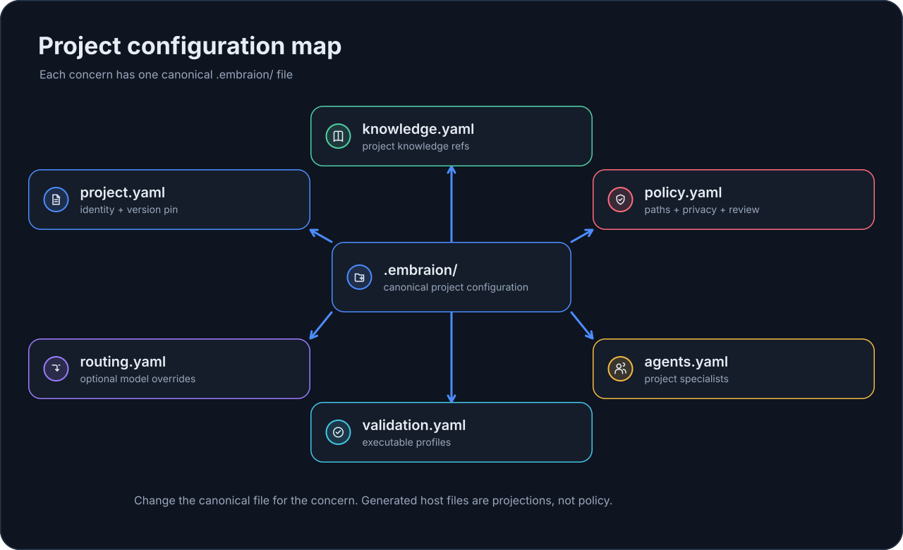

# Configure EmbrAIon for Your Project

After `embraion init`, your repository owns a small configuration surface under `.embraion/`.

A useful mental model is:

> **EmbrAIon Core provides the engineering mechanisms; `.embraion/` contains this project's Settings.**

The project should describe facts and preferences that are specific to the repository. It should not copy generic EmbrAIon behavior into local scripts or prompt files.

## Understand it by question, not schema

| Question | Canonical file |
| --- | --- |
| What project is this and which EmbrAIon release does it use? | `project.yaml` |
| What facts and architecture should the AI know? | `knowledge.yaml` |
| Which paths are canonical, protected, generated, or external? | `policy.yaml` |
| What privacy/review/enforcement rules apply? | `policy.yaml` |
| Which concrete execution/model choices does this project reuse? | `deployments.yaml` |
| Should this project override the AI client's model selection? | `routing.yaml` |
| Which commands prove a change works? | `validation.yaml` |
| Does this project need domain-specific AI specialists? | `agents.yaml` |
| Does this project use provider-neutral executable bindings? | optional `execution.yaml` |
| Does this project maintain reviewed provider pricing sources? | optional `pricing.yaml` |

{ loading=lazy }

## Project-owned layout

```text
.embraion/
├── .gitignore
├── project.yaml
├── knowledge.yaml
├── policy.yaml
├── deployments.yaml
├── routing.yaml
├── validation.yaml
└── agents.yaml
```

Projects that opt into EmbrAIon's provider-neutral execution/pricing runtime may also add `execution.yaml`, `pricing.yaml`, validated pricing snapshots, and usage evidence.

Runtime state may later appear under `.embraion/state/` and `.embraion/cache/`. Those directories are intentionally ignored by `.embraion/.gitignore`.

## The ownership rule

**EmbrAIon owns reusable mechanisms.**

Examples: generic roles, skills, route classes, projection behavior, validation/review mechanics, provider-neutral execution/fallback/health contracts, security and evidence handling.

**The repository owns project facts.**

Examples: architecture, protected paths, concrete deployments, routing preferences, project-specific agents, validation commands, credential references, and pricing sources.

Generated Codex, Copilot, Claude Code, and Portable files are projections of that canonical contract rather than a second place to express policy.

Project configuration may make local rules stricter, but it must not silently weaken reusable Core hard gates.

## You can configure it conversationally

Manual YAML editing is optional.

Once the AI host projection is installed, you can describe the result you want:

> Configure routing for this repository. Keep bounded work inexpensive, use stronger reasoning for complex work, and reserve critical routing for exceptional risk.

The AI client should inspect the current project contract and update the appropriate canonical `.embraion/` files. It should not create a parallel routing table in an arbitrary Markdown file.

Other examples:

> Register our architecture document as the architecture source of truth.

> Mark vendor code as protected and external.

> Add the integration test command to affected validation.

> Add a read-only domain specialist for persistence compatibility.

The user does not need to memorize which YAML file owns each concern; the host projection teaches the AI that mapping.

## Recommended order

Do not configure everything at once. A normal project usually benefits from this order:

1. **Identity** — confirm `project.yaml`.
2. **Knowledge** — register project and architecture truth.
3. **Policy** — classify source paths and choose privacy/review defaults.
4. **Validation** — add the commands that actually prove changes work.
5. **Host projection** — install the AI client(s) you use.
6. **Agents** — add project specialists only when Core roles are not enough.
7. **Deployments** — register reusable project-owned execution choices only when needed.
8. **Routing** — leave host-default unless explicit project selection is useful.
9. **Execution/pricing** — configure only when the project uses the provider-neutral runtime.
10. **Enforcement** — enable only after policy and validation are trustworthy.

## Baseline configuration

### `project.yaml`

```yaml
framework:
  repository: GORYNED/EmbrAIon
  version: <pinned-version>

project:
  name: <project-name>

capabilities: {}
```

### `knowledge.yaml`

```yaml
{}
```

### `policy.yaml`

```yaml
sources:
  canonical: []
  protected: []
  generated: []
  external: []

review:
  substantial-required: true

privacy:
  default-class: PRIVATE

enforcement:
  enabled: false
  validation-profile: affected
  require-review: false
```

### `deployments.yaml`

```yaml
providers: {}
deployments: {}
```

### `routing.yaml`

```yaml
overrides: {}
```

### `validation.yaml`

```yaml
profiles:
  fast: []
  affected: []
  full: []
```

### `agents.yaml`

```yaml
agents: []
```

## Inspect what the AI changed

After conversational configuration, inspect the actual project contract:

```bash
embraion doctor
embraion policy show
embraion validation list
embraion status
```

For routing:

```bash
embraion route --host codex --route-class complex --data PRIVATE
```

For generated host files, preview changes before reinstalling:

```bash
embraion projection diff --host codex --destination .
```

## Continue by concern

- [Project configuration files](project-files.md)
- [Project knowledge](knowledge.md)
- [Policy & protected paths](policy.md)
- [Validation profiles](validation.md)
- [Project agents](agents.md)
- [Project deployments](deployments.md)
- [Model routing](../model-routing.md)
- [Configure with your AI client](ai-hosts.md)
