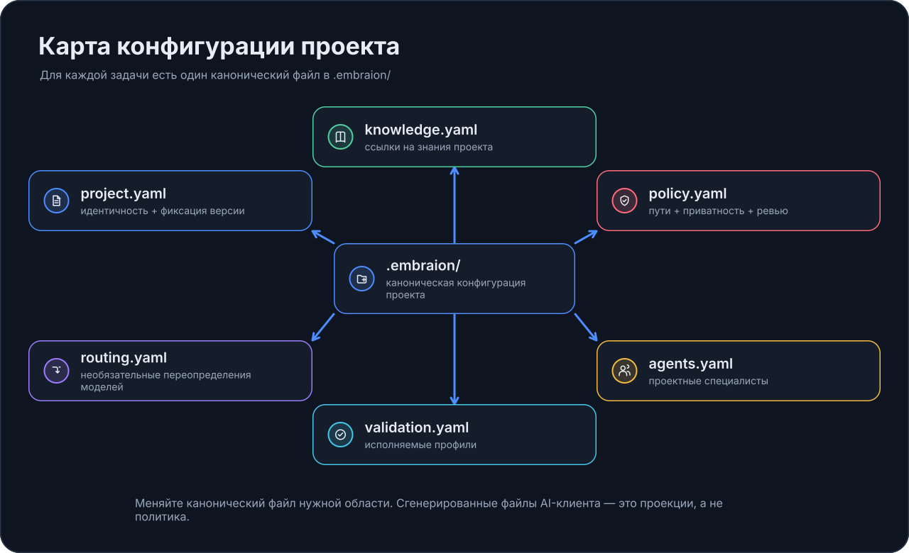

# Настройка EmbrAIon для проекта

После `embraion init` репозиторий владеет небольшой поверхностью конфигурации в `.embraion/`.

!!! tip "Простыми словами"
    Не нужно настраивать всё сразу. Для первого полезного результата ответьте на три вопроса: **Что AI должен знать? Какие правила он должен соблюдать? Чем доказать, что изменение работает?**

## Начните с трёх файлов

| Первый вопрос | Начните здесь |
| --- | --- |
| Что AI должен знать о проекте? | `.embraion/knowledge.yaml` |
| Какие source/path/privacy правила нужно соблюдать? | `.embraion/policy.yaml` |
| Какие команды доказывают корректность изменения? | `.embraion/validation.yaml` |

Остальное может оставаться на безопасных defaults, пока реально не понадобится.

### Как может выглядеть минимальный результат

После conversational setup полезный diff может быть очень маленьким:

```yaml
# .embraion/knowledge.yaml
slots:
  architecture:
    path: docs/architecture.md
```

```yaml
# .embraion/policy.yaml
sources:
  protected:
    - vendor/**
```

```yaml
# .embraion/validation.yaml
profiles:
  affected:
    - python -m pytest
```

Можно редактировать YAML напрямую, но обычно проще сказать AI:

> Зарегистрируй наш architecture document, защити `vendor/**` и сделай `python -m pytest` командой affected validation.

!!! tip "Или просто скажите AI"
    > Изучи этот репозиторий и настрой минимально полезный EmbrAIon project contract: привяжи существующие architecture/source-of-truth knowledge, классифицируй важные source paths и добавь реальные validation commands. Model routing оставь на host-default, если нет явной необходимости.

## Выберите глубину

- **Простая настройка:** knowledge + policy + validation → установить host projection → начать работу.
- **Полная инженерная настройка:** добавлять project agents, deployments, routing, provider execution, pricing и enforcement только при необходимости.

[Инженерная модель](../reference/engineering-model.md)

## Карта конфигурации: вопрос → файл

| Вопрос | Канонический файл |
| --- | --- |
| Что это за проект и какую версию EmbrAIon он использует? | `project.yaml` |
| Какие факты и архитектуру AI должен знать? | `knowledge.yaml` |
| Какие пути canonical, protected, generated или external? | `policy.yaml` |
| Какие privacy/review/enforcement rules действуют? | `policy.yaml` |
| Какие конкретные execution/model choices проект переиспользует? | `deployments.yaml` |
| Нужно ли переопределять model selection host? | `routing.yaml` |
| Какие команды доказывают корректность? | `validation.yaml` |
| Нужны ли domain-specific AI specialists? | `agents.yaml` |
| Используется ли provider-neutral execution? | опциональный `execution.yaml` |
| Нужны ли проверенные pricing sources? | опциональный `pricing.yaml` |

{ loading=lazy }

## Правило ownership

**EmbrAIon Core владеет переиспользуемыми механизмами.**

**Репозиторий владеет фактами и настройками проекта.**

Generated host files — это projections канонического контракта, а не второе место для поддержания project policy.

## Разговорные примеры

Можно сказать AI:

> Зарегистрируй наш architecture document как architecture source of truth.

> Пометь `vendor/**` как protected, а generated build outputs — как generated.

> Добавь integration test command в affected validation.

> Оставь model selection на host-default.

> Добавь read-only domain specialist только если существующих Core roles недостаточно.

Смысл не в том, чтобы человек запоминал YAML, а в том, чтобы для каждого типа настройки было одно корректное место.

## Рекомендуемый порядок

1. **Identity** — проверить `project.yaml`.
2. **Knowledge** — зарегистрировать project truth.
3. **Policy** — классифицировать source paths и privacy/review defaults.
4. **Validation** — добавить реальные команды.
5. **Host projection** — установить нужные hosts.
6. **Agents** — только project-specific specialists.
7. **Deployments / routing** — только когда нужен явный selection.
8. **Execution / pricing** — только для provider-neutral runtime.
9. **Enforcement** — после того как policy и validation заслуживают доверия.

## Проверьте изменения

```bash
embraion doctor
embraion policy show
embraion validation list
embraion status
```

Для routing:

```bash
embraion route --host codex --route-class complex --data PRIVATE
```

Для generated host files:

```bash
embraion projection diff --host codex --destination .
```

## Дальше по темам

- [Файлы проекта](project-files.md)
- [Знания проекта](knowledge.md)
- [Policy и protected paths](policy.md)
- [Настройка validation](validation.md)
- [Агенты проекта](agents.md)
- [Deployments проекта](deployments.md)
- [Model routing](../model-routing.md)
- [Execution и провайдеры](execution.md)
- [Pricing и стоимость](pricing.md)
- [Разговорная настройка](ai-hosts.md)
