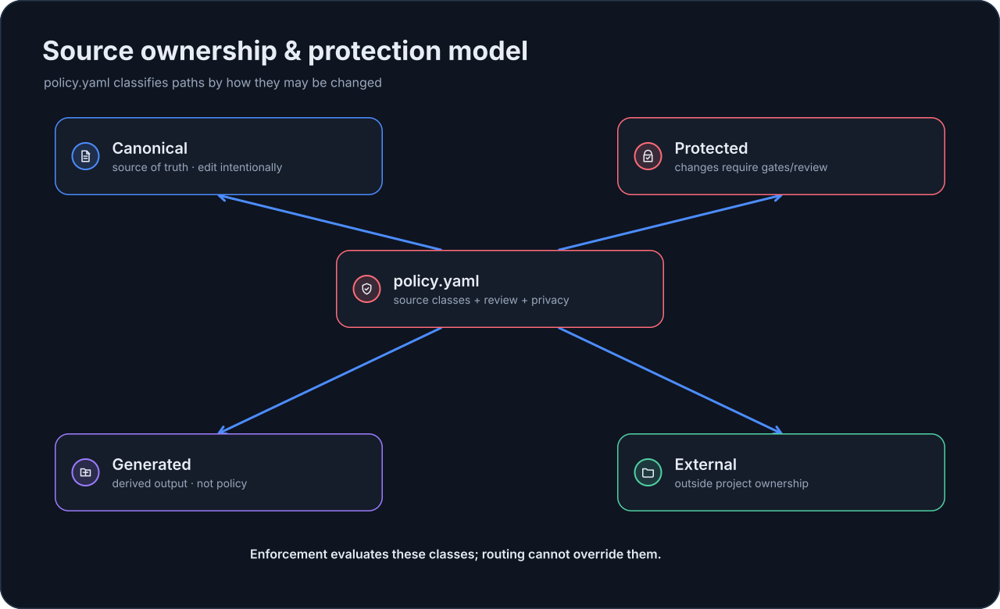

# Policy & Protected Paths

`.embraion/policy.yaml` contains project-owned safety policy.

{ loading=lazy }

A typical configuration:

```yaml
sources:
  canonical:
    - src/**
    - knowledge/**
  protected:
    - vendor/**
  generated:
    - build/**
  external:
    - external/**

review:
  substantial-required: true

privacy:
  default-class: PRIVATE

enforcement:
  enabled: false
  validation-profile: affected
  require-review: false
```

## Source classes

### `canonical`

Project-owned source of truth. These are normal authored files.

### `protected`

Paths that ordinary writable work must not mutate. Use this for material that requires a separate approval or ownership path.

Protected-path checks cover modifications, additions where relevant, deletions, rename sources, and dot-prefixed paths such as `.github/**`.

### `generated`

Build output or other derived files that should not be mistaken for canonical authored source.

Files that `embraion install` recorded in a projection ledger under `.embraion/state/projections` also count as generated, so installed host projections need no hand-maintained entries. Explicit entries stay supported and come first. Files that a projection merges into user-owned content, `.claude/settings.json` and `.codex/config.toml` in merge mode, are not added. The ledgers are local state: a fresh checkout without them uses only the explicit entries. `embraion policy show --json` lists the derived entries under `derived-sources.generated`, and `embraion validate` warns when Git ignores a ledger file.

### `external`

Material sourced from outside the project and governed separately from project-owned source.

## Review policy

```yaml
review:
  substantial-required: true
```

This expresses the project rule that substantial work requires review evidence where the execution contract calls for it.

## Privacy default

```yaml
privacy:
  default-class: PRIVATE
```

Valid classes are `PUBLIC`, `PRIVATE`, and `CONFIDENTIAL`.

Model choice cannot widen these boundaries.

## Enforcement policy

Enforcement is disabled by default:

```yaml
enforcement:
  enabled: false
  validation-profile: affected
  require-review: false
```

Do not manually flip this block and assume CI is installed. Use the explicit command when you are ready to add the GitHub Actions surface:

```bash
embraion enforcement install \
  --surface github-actions \
  --validation-profile affected
```

See [Enforcement](../guides/enforcement.md) for the complete workflow.

## Merge mode

```yaml
merge:
  mode: human-only
```

The optional `merge.mode` selects who may merge a pull request under the [human merge rule](https://github.com/GORYNED/EmbrAIon/blob/main/core/rules/human-merge.md):

- `human-only` (the default when `merge` is omitted): agents stop at a reviewable pull request and a human merges.
- `owner-permission`: an agent may merge a pull request only with the owner's explicit permission for that pull request, after the required checks pass on its final head and the independent reviewer confirms that exact head.

Auto-merge is never enabled in either mode. Any other value fails validation and projection. Host installation states the selected mode in one line of the projected Core rules (`.claude/rules/embraion-core.md`, `.github/instructions/embraion-core.instructions.md`, and the managed Codex block); run `embraion install` again after changing it, and `projection verify` reports the stale line until then.

## Policy ceilings

`ceilings` declares the most a project allows. Deployments, execution bindings, and routing may narrow these limits but never widen them, so a routine YAML edit cannot silently grant a provider more data, access, or sources:

```yaml
ceilings:
  providers:
    deepseek:
      data-classes: [PUBLIC]
      access-modes: [read-only]
      roles: [research]
      sources: [PublicOfficialUpstream]
    anthropic:
      data-classes: [PUBLIC, PRIVATE]
      access-modes: [read-only]
      roles: [independent-review]
      binding-required-billing-modes: [api]
  data-classes:
    CONFIDENTIAL: {providers: [openai]}
  sources:
    VendorSdk: {providers: [openai]}
  task-classes:
    protected-decision: {route-class: critical}
  critical:
    justifications: [security-critical, migration-data-loss, recovery-integrity, exceptional-systemic-risk]
```

- `providers.<provider>` limits every enabled deployment of that provider. A listed dimension that the deployment leaves out counts as unrestricted and fails. `sources` limits the deployment's execution binding `sourceIds`. When `data-classes` or `roles` are limited, the binding must list `taskClasses`, and every task class that the binding or routing sends to the deployment must stay within the limit. `binding-required-billing-modes` requires an execution binding for those billing modes.
- Host overrides under `overrides.<host>` in `.embraion/routing.yaml` are checked with their fallbacks. Every request an override matches must stay within the ceiling. Routing refuses a data class that the selected deployment's `capabilities.data-classes` does not list, so a deployment whose data classes are within the ceiling bounds the data class of every request. A `routes` override also matches requests with any role or none, so selecting a ceilinged deployment is `ceiling-unbounded` when that provider limits `roles`, or limits `data-classes` beyond what the deployment's capabilities bound. A `roles` or `route-roles` override must name a role within the `roles` ceiling (`ceiling-role`), and it is `ceiling-unbounded` when the provider limits `data-classes` and the deployment's capabilities do not keep them within it. `task-classes` overrides are checked like routing task classes.
- `data-classes.<class>.providers` allows that data class only for these providers. A deployment without a `data-classes` list counts as allowing every class.
- `sources.<sourceId>.providers` allows an execution source only for these providers.
- `task-classes.<id>` pins the route class, role, or data class of a routing task class so it cannot be lowered.
- `critical.justifications` turns critical-route justification into a closed set. `embraion route`, `dispatch`, and `execute` then accept only `<reason>` or `<reason>: details` with a listed reason.

Check the ceilings explicitly or as part of `embraion validate` inside the project:

```bash
embraion policy check
embraion policy check --json
embraion validate
```

Each finding names the file location and the ceiling it exceeds. Projects without `ceilings` keep the previous behavior.

## Projection root checks

Codex merge mode keeps user-owned content in `.codex/config.toml`. The optional `projection` section decides how `embraion projection verify --config-mode merge` treats that content:

```yaml
projection:
  codex:
    strict-root: true
    forbidden-root-keys:
      - profiles.*.model
    allowed-root-keys:
      - mcp_servers
```

- `forbidden-root-keys` adds dotted key patterns to the Core defaults `model`, `model_reasoning_effort`, and `agents.default_subagent_*`. A project can extend the defaults but cannot remove them.
- `allowed-root-keys` is an optional allowlist of top-level keys. `developer_instructions` and `agents` are always allowed because EmbrAIon manages blocks inside them.
- Root `developer_instructions` text outside the managed orchestration block is always reported.
- `strict-root: true` turns these findings into verification failures, the same as `--strict-root`. Without it they are warnings and verification still depends only on projection drift.

## Inspect the effective policy

```bash
embraion policy show
embraion policy show --json
```

Invalid project configuration fails closed instead of being interpreted heuristically.
