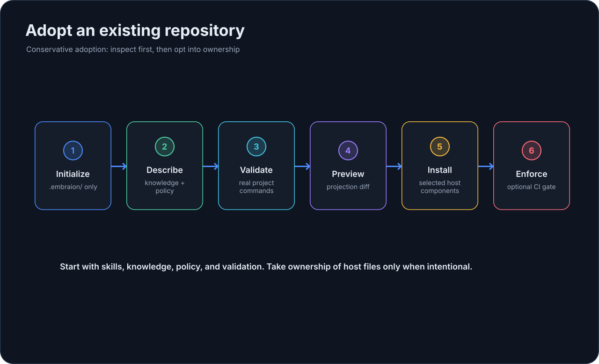

# Подключить существующий репозиторий

EmbrAIon можно добавить в зрелый репозиторий, не забирая ownership файлов, которыми уже управляет проект или AI-клиент.

Самый безопасный подход — пошаговое подключение.

## 1. Инициализируйте конфигурацию проекта

Из корня репозитория:

```bash
embraion init
embraion doctor
```

Это создаёт `.embraion/` и local state/cache ignore rules. Исполняемые hooks и enforcement не устанавливаются.

## 2. Подготовьте установку Bootstrap

Сначала проверьте существующие `.embraion/**` и ownership host files. Если проект уже инициализирован, сохраните его конфигурацию. Следующий шаг устанавливает canonical skills без слепой перезаписи host settings. После установки напишите «Настрой EmbrAIon для этого проекта». Bootstrap изучит существующие документы, policy и CI, сохранит намеренные settings и свяжет реальные sources/validation commands. См. [Project Bootstrap](../configuration/bootstrap.md).

## 3. Сначала просмотрите host adoption

Если в репозитории уже есть Codex/Copilot/Claude configuration, не перезаписывайте её сразу.

Посмотрите projection:

```bash
embraion projection diff --host codex --destination .
```

Для selective adoption начните с reusable skills:

```bash
embraion projection diff   --host codex   --destination .   --component skills
```

Затем установите только этот component:

```bash
embraion install   --host codex   --destination .   --component skills
```

Повторяйте `--component` только когда осознанно хотите передать EmbrAIon ownership дополнительных components.

Если зрелый Codex-репозиторий уже владеет `.codex/config.toml`, используйте partial config ownership вместо замены файла:

```bash
embraion projection diff   --host codex   --component config   --config-mode merge

embraion install   --host codex   --component config   --config-mode merge
```

Так project-owned Codex settings сохраняются, а EmbrAIon управляет только необходимыми ключами `[agents]`.

## 4. Разрешайте конфликты осознанно

EmbrAIon отличает сгенерированные файлы, которые можно безопасно обновить, от user-owned или локально изменённых.

Projection ownership state в `.embraion/state/` локален и gitignored. Если framework update запускается в свежем worktree без локального projection ledger, EmbrAIon пробует консервативно восстановить ownership из точного предыдущего project pin. Файл считается восстановленным только если текущие bytes точно совпадают с projection предыдущей опубликованной версии EmbrAIon.

Если предыдущий runtime не удаётся разрешить, destination отличается или файл был изменён, EmbrAIon не угадывает ownership и продолжает сообщать conflict. Recovery никогда не работает как `--force`.

Если `projection diff` показывает конфликт:

1. изучите конфликтующий файл;
2. решите, какая система должна им владеть;
3. предпочитайте selective installation, если нужны только некоторые components;
4. используйте `--force` только при явно намеренной замене.

## 5. Проверьте контракт проекта

```bash
embraion doctor
embraion status
embraion context slots
embraion policy show
embraion validation list
```

Если validation profiles содержат реальные команды, запустите подходящий профиль. Structured profiles могут объявлять runtime parameters для base ref, head ref, filter или justification:

```bash
embraion validation run affected --param base-ref=origin/main
```

После установки host projections добавьте strict parity gate:

```bash
embraion projection verify --host codex --component agents --component skills
embraion projection verify --host copilot
```

Чистая проверка завершается с кодом 0. Любой create/update/conflict/obsolete drift даёт non-zero, поэтому команда подходит для CI.

## 6. Enforcement добавляйте последним

Не начинайте adoption с merge enforcement. Сначала сделайте project policy и validation надёжными.

Когда они готовы, enforcement можно установить явно:

```bash
embraion enforcement install   --surface github-actions   --validation-profile affected
```

Перед тем как делать status check обязательным, прочитайте [Enforcement](../guides/enforcement.md).

## Рекомендуемый порядок подключения

{ loading=lazy }

## Дальше

[Настройте проект](../configuration/index.md) или [запустите первую AI-задачу](first-ai-task.md).
