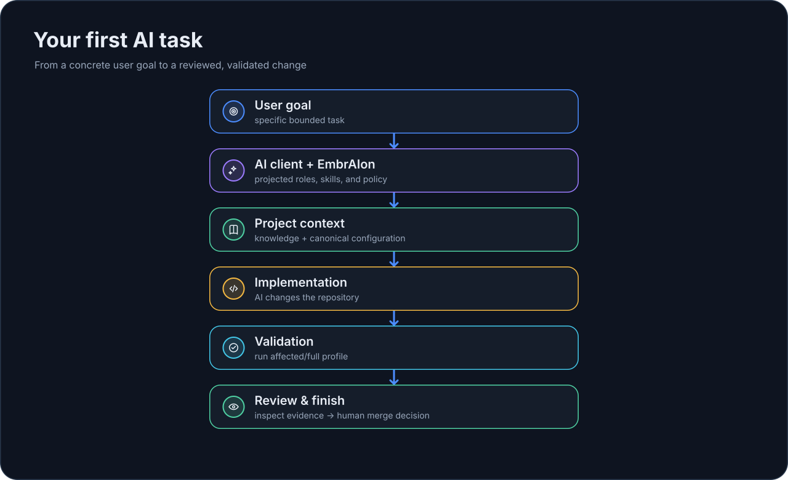

# Your First AI Task

Once EmbrAIon is initialized and your AI-client projection is installed, normal engineering should still feel normal: you describe the task to your AI client and work in the repository.

EmbrAIon provides the surrounding project contract.

## 1. Check project health

```bash
embraion doctor
embraion status
```

Fix configuration errors before asking the AI to make a substantial change.

## 2. Give the AI a real task

For example:

> Add a small user-facing feature. Follow this repository's EmbrAIon project knowledge and policy. Use the relevant projected skills/agents, stay inside the allowed source boundaries, run the configured affected validation, and report any residual risk.

You do not need to tell the AI which model to use unless your project intentionally configured routing overrides.

## 3. Let the host use projected capabilities

Depending on the AI client, the repository may contain generated EmbrAIon agents and skills. Those files translate reusable Core behavior and project-specific agents into host-native instructions.

The AI host still performs the actual reasoning and code execution.

## 4. Run project validation

Inspect available profiles:

```bash
embraion validation list
```

If `affected` has real commands configured:

```bash
embraion validation run affected
```

An empty profile reports `skipped`; it is not treated as evidence of a pass. Configure `.embraion/validation.yaml` before relying on validation as a gate.

## 5. Review the change

For meaningful changes, use independent review appropriate to your project. EmbrAIon can record review/evidence and can optionally enforce review through an explicitly installed CI surface, but it does not remove the human decision to merge.

## 6. Inspect the final state

Useful checks:

```bash
embraion doctor
embraion status
```

If you changed host configuration intentionally, preview projection ownership before reinstalling:

```bash
embraion projection diff --host codex --destination .
```

## What a normal task looks like

{ loading=lazy }

For a practical recurring routine, continue with [Daily Workflow](../guides/daily-workflow.md).
