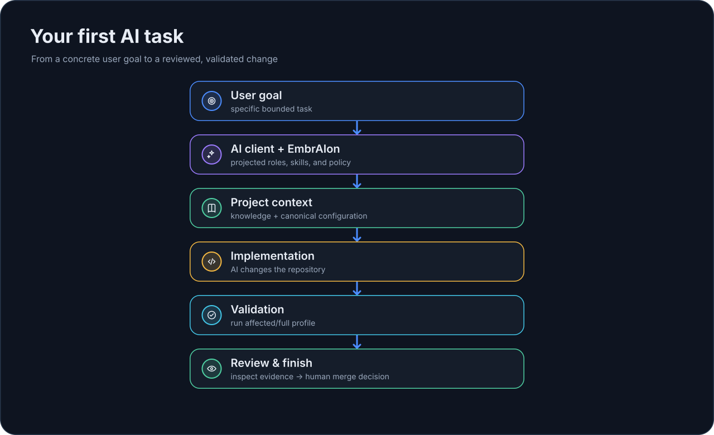

# Первая задача для AI

После инициализации EmbrAIon и установки host projection **обычная инженерная работа должна оставаться обычной**.

!!! tip "Простыми словами"
    Вы просите продуктовый или инженерный результат. Правила проекта уже находятся в репозитории.

## Первый рабочий цикл

| Вы делаете | Что происходит за кулисами | Вы проверяете |
| --- | --- | --- |
| Просите: «Добавь retry при ошибке соединения» | Host использует projected roles/skills, knowledge и policy | Code change |
| AI реализует задачу | Действует существующий routing/default model policy | Protected paths не нарушены |
| Запускаете проверки | EmbrAIon выполняет validation profile | Получен `passed`, а не `skipped` |
| Делаете review существенной работы | Применяются review/evidence rules, если настроены | Решение о merge |

## 1. Проверьте состояние проекта

```bash
embraion doctor
embraion status
```

Для маленькой задачи в уже проверенном репозитории не нужно запускать diagnostics перед каждым изменением.

## 2. Просите результат

После setup используйте обычный инженерный запрос:

> Добавь retry при ошибке соединения и regression coverage.

Не используйте перегруженные framework prompt'ы вроде:

> Используй EmbrAIon, выбери агента и модель, прочитай эти файлы, запусти эти проверки, а потом сделай retry.

Эта настройка уже должна принадлежать репозиторию.

**После установки вы почти не должны думать про EmbrAIon во время обычной продуктовой работы.** Возвращайтесь к EmbrAIon, когда намеренно меняете сам project contract: knowledge, policy, validation, routing, agents или enforcement.

## 3. Что происходит за кулисами

```text
ваша задача
  ↓
AI host
  ↓
generated EmbrAIon host files
  +
project knowledge / policy / optional routing
  ↓
implementation
```

Reasoning и изменения по-прежнему выполняет AI host.

## 4. Validation

```bash
embraion validation list
embraion validation run affected
```

!!! warning
    `skipped` — не pass. Это значит, что профиль не содержит исполняемых команд.

## 5. Review и завершение

Для существенных изменений используйте review policy репозитория и явно фиксируйте residual risk.

Если host projections намеренно менялись:

```bash
embraion projection diff --host codex --destination .
```

{ loading=lazy }

Дальше: [Ежедневный процесс](../guides/daily-workflow.md).
