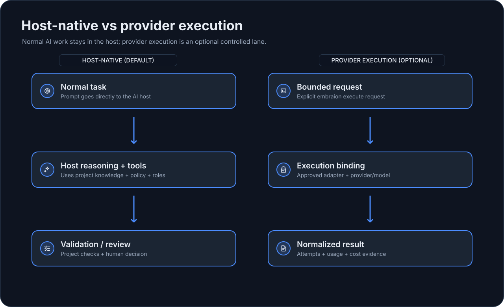
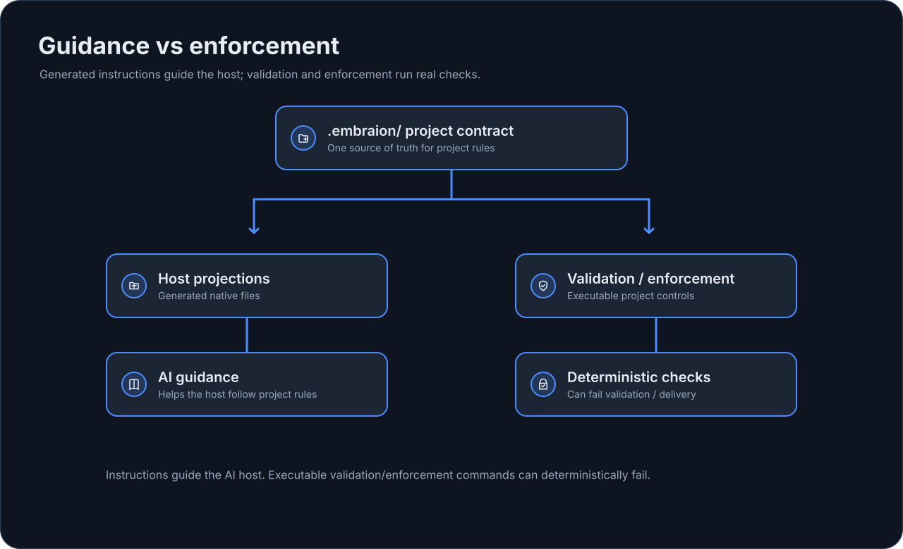

# How EmbrAIon Works

!!! tip "In plain English"
    You still type a normal request into Codex, Copilot, or Claude Code. The host already has generated native files that point it at the repository's EmbrAIon contract. EmbrAIon does not intercept the chat; it gives the host shared project rules and provides real commands for validation, enforcement, and optional provider execution.

## The simple path: host-native work

This is the path most projects use every day.

```text
you ask for an engineering outcome
          ↓
Codex / Copilot / Claude Code
          ↓
generated host-native EmbrAIon files
          +
project .embraion/ settings
          ↓
AI reasoning / edits / tools
          ↓
project validation
          ↓
review / evidence / human merge
```

{ loading=lazy }

For the first useful setup, focus on:

- **Knowledge** — what the AI should know.
- **Policy** — what paths/rules it should respect.
- **Validation** — what commands prove the result works.

Routing, custom deployments, provider execution, pricing, and enforcement can stay at defaults until needed.

## What is guidance vs what really executes?

!!! note "For engineers"
    Generated agents and skills are host-native instructions. They guide the AI client. They are not the same thing as executable framework checks.

{ loading=lazy }

```bash
embraion validation run affected
embraion enforcement check --base-ref origin/main
```

Those commands run real deterministic checks.

For the complete ownership model, see [Engineering Model Deep Dive](../reference/engineering-model.md).

## The advanced path: provider execution

Some projects also want a controlled external/API lane.

```text
bounded execution request
      ↓
project deployment + execution binding
      ↓
EmbrAIon provider-neutral runtime
      ↓
approved provider/model
      ↓
normalized result / attempts / usage / cost
```

This is optional. Ordinary Codex/Copilot/Claude conversations do not pass through it.

See [Execution & Providers](../configuration/execution.md).

## Conversational configuration

You can say:

> Mark `vendor/**` protected, register our architecture document, and add the integration test command to affected validation.

The AI host should update the canonical project files for those concerns.

!!! tip "You do not need to memorize YAML"
    The point of `.embraion/` is not to make humans remember more filenames. It gives the repository and the AI **one authority per concern**.

## Next

- [Your First AI Task](first-ai-task.md)
- [Daily Workflow](../guides/daily-workflow.md)
- [Engineering Model Deep Dive](../reference/engineering-model.md)
