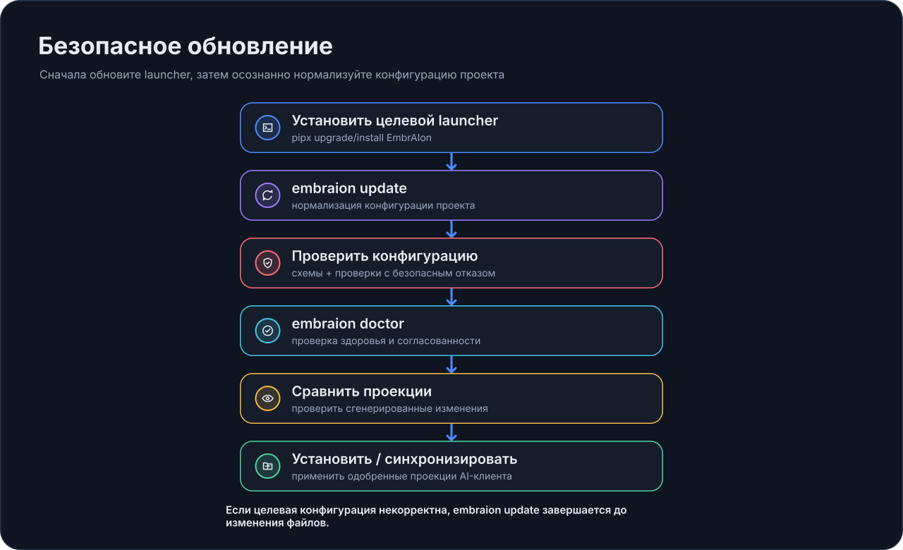

# Безопасное обновление

У EmbrAIon есть две версии, о которых нужно помнить:

1. глобальный launcher, установленный на машине;
2. точная framework release, закреплённая каждым проектом.

Обновление проекта всегда намеренное.

{ loading=lazy }

## Обычный процесс обновления

Сначала обновите launcher:

```bash
pipx upgrade embraion
```

Затем внутри проекта:

```bash
cd MyProject
embraion update
embraion doctor
embraion status
```

Обновление launcher не мигрирует все репозитории автоматически.

## Почему launcher должен соответствовать target version

Safe configuration normalization принадлежит установленной версии launcher.

Поэтому `embraion update` целится в установленную launcher version, а не пытается заставить одну версию угадывать schema/defaults другой.

Если нужна другая опубликованная release, сначала установите нужную launcher version, затем запускайте `embraion update`.

## Что update может изменить

Для совместимого modular layout `.embraion/` update может:

- переместить project pin на активную launcher version;
- добавить отсутствующие совместимые defaults;
- сохранить существующие project-owned values.

До записи EmbrAIon строит и валидирует candidate configuration всех канонических project files.

## Что update не делает

`embraion update` **не**:

- угадывает migration для неполного/legacy layout;
- эвристически переписывает несовместимые user-owned values;
- автоматически обновляет Codex/Copilot/Claude/Portable projections;
- переписывает projection ownership state.

При несовместимости update завершается до перезаписи канонических файлов.

## Отдельно проверяйте host projections

После update:

```bash
embraion projection diff --host codex --destination .
```

Переустанавливайте projection только если осознанно хотите принять новое generated output.

## Version resolution

Старые проекты могут оставаться на старых опубликованных releases, даже если глобальный launcher новее. Обычные команды могут разрешить точный project runtime из локального cache.

См. [Runtime и разрешение версий](../reference/runtime-version-resolution.md).

## Совместимость pre-1.0

Patch releases предназначены для совместимых исправлений и улучшений. Minor releases могут развивать framework contracts. Перед обновлением production-репозитория между minor versions проверяйте release notes.
