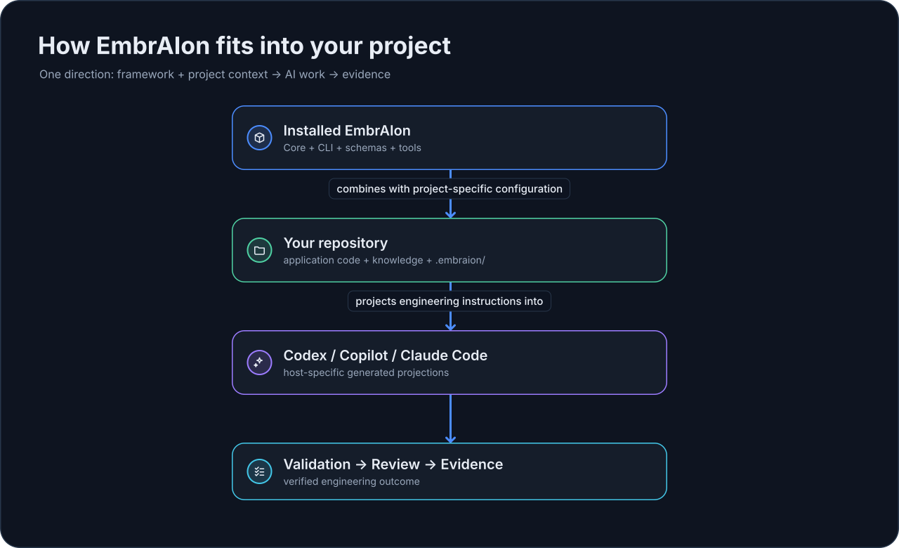
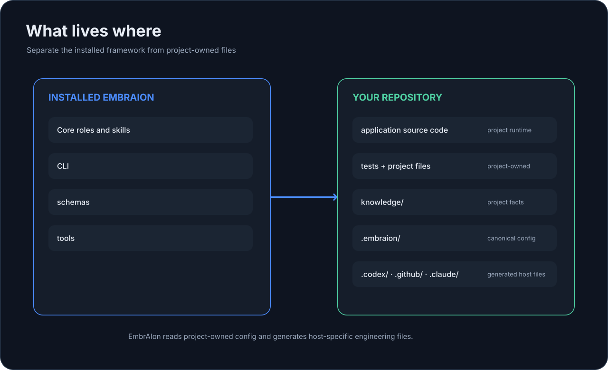

# What Is EmbrAIon?

EmbrAIon is an **engineering system for AI-assisted software development**.

It gives a repository a consistent way to tell AI clients:

- what the project is;
- where project truth lives;
- which paths are canonical, protected, generated, or external;
- which engineering roles and reusable skills exist;
- which project-specific agents are available;
- how work is routed;
- which validation commands produce acceptable evidence;
- when review or explicit enforcement is required.

## What EmbrAIon is not

EmbrAIon is **not**:

- an application runtime or SDK dependency;
- a replacement for Codex, GitHub Copilot, or Claude Code;
- a global catalog of current AI models;
- a system that silently installs hooks or CI into every repository;
- a substitute for the project's source code, architecture, tests, or product specification.

Your application remains an ordinary application. EmbrAIon sits around the engineering workflow.

## How EmbrAIon fits into your project

{ loading=lazy }

There is only one direction to remember: **EmbrAIon helps your AI client work on the repository, then the work is validated and reviewed.**

The finished application does not depend on EmbrAIon at runtime.

## What lives where

{ loading=lazy }

**Core** contains reusable engineering behavior that should work across projects.

**Project configuration** lives in `.embraion/` and contains facts and policy that belong to this repository.

**Project knowledge** remains ordinary repository content, typically under `knowledge/`, and is referenced by `.embraion/knowledge.yaml`.

**Host projections** are generated files for the AI client. They are not the canonical source of project policy.

## Model selection

EmbrAIon is model-agnostic. Without a project override, the active AI client chooses its own default or automatic model.

If your project needs explicit model routing, store only host-specific overrides in `.embraion/routing.yaml`. Model selection never widens privacy, access, source protection, validation, or review permissions.

## What gets committed

Usually committed:

- `.embraion/project.yaml`
- `.embraion/knowledge.yaml`
- `.embraion/policy.yaml`
- `.embraion/routing.yaml`
- `.embraion/validation.yaml`
- `.embraion/agents.yaml`
- project knowledge files
- selected generated host projections that your repository intentionally owns

Usually not committed:

- `.embraion/state/`
- `.embraion/cache/`

## Common questions

### Does EmbrAIon run inside my finished application?

No. It is used while engineering the repository.

### Do I have to edit YAML manually?

No. You can ask the AI client already working in the repository to configure EmbrAIon. The generated `routing-configuration` skill and project documentation tell it which canonical file owns each concern.

### Can I use more than one AI client?

Yes. Install each host projection you want the repository to support.

### Does EmbrAIon automatically block unsafe merges?

No. Project validation and enforcement are explicit. If you install the GitHub Actions enforcement surface, repository branch rules still decide whether that status check is mandatory for merge.

### Is a specific model required?

No. Core is intentionally independent of current model names.

## Next

[Install EmbrAIon](installation.md).
