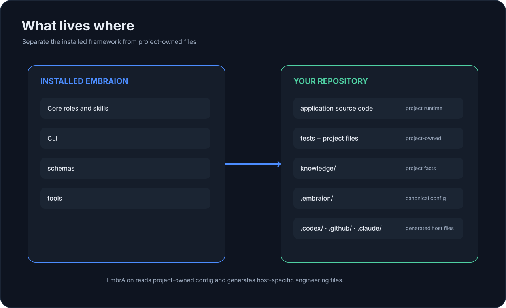

# Why EmbrAIon?

EmbrAIon is an **AI-First Engineering System** for software repositories.

Its purpose is not to make an AI model smarter. Its purpose is to make AI-assisted engineering **repeatable, project-aware, reviewable, and portable across sessions and AI clients**.

## The problem it solves

A useful AI coding session quickly accumulates rules:

- where architecture truth lives;
- which files are protected or generated;
- what may leave the repository;
- which agent or specialist should own a concern;
- which model or provider is appropriate for a class of work;
- which tests are required;
- whether independent review is mandatory;
- what evidence should exist before a human merges the change.

Without a framework, these rules tend to end up in several places at once: prompts, `AGENTS.md`, host-specific agent files, model settings, shell scripts, CI, and a developer's memory.

That works until the project grows, another AI client is introduced, the available models change, or a fresh session does not know the assumptions from the previous one.

EmbrAIon gives the repository one durable contract for those concerns.

## The simplest mental model

> **EmbrAIon is the operating system for AI-assisted engineering; `.embraion/` is the Settings for this repository.**

This is an analogy. EmbrAIon is not literally an operating system and it does not intercept every prompt.

The important separation is:

- **EmbrAIon Core owns reusable mechanisms** that should work across projects.
- **The repository owns project facts and preferences** in `.embraion/`.
- **The AI host owns the actual conversation, reasoning, and host capabilities.**

## What EmbrAIon Core owns

Reusable mechanisms include:

- generic engineering roles such as Lead, Architect, Reviewer, Validator, and Worker;
- reusable skills and workflow procedures;
- project-contract schemas;
- model-agnostic route classes;
- host projections;
- generic validation, review, security, worktree, evidence, and enforcement mechanics;
- provider-neutral execution, failure/fallback, health, and cost contracts where a project opts into them.

These belong in Core because another repository should not have to reinvent them.

## What the project owns

The consuming repository knows facts that Core cannot know:

- its architecture and source-of-truth documents;
- protected, generated, canonical, and external paths;
- default privacy and review policy;
- which concrete deployments/models/providers it wants to reuse;
- optional routing preferences;
- validation commands that actually prove this project works;
- domain-specific agents or specialists;
- optional execution bindings, credential references, and pricing sources.

Those belong to the repository's `.embraion/` configuration.

The project can make policy stricter, but it should not reimplement generic EmbrAIon mechanisms just to customize project behavior.

## What happens when you send a normal prompt

Suppose you write:

> Fix the reconnect flow when a network operation fails.

EmbrAIon does not receive that message first and forward it to Codex or Copilot.

Instead, the AI client is already operating inside a repository that contains generated EmbrAIon projections. Those projections tell the host where the canonical project contract lives and which reusable roles/skills are available.

The effective flow is:

```text
Your request
    │
    ▼
Codex / Copilot / Claude Code
    │
    ├── host-native EmbrAIon agents and skills
    ├── project knowledge and policy from .embraion/
    ├── optional project routing
    └── project validation/review contract
    │
    ▼
engineering work
    │
    ▼
validation → review → evidence → human merge
```

The host still performs the reasoning and code changes. EmbrAIon supplies the engineering contract.

## What configuration feels like

You can edit YAML directly, but that is not the intended requirement.

A normal user can tell the AI already working in the repository:

> Configure routing for this project. Use inexpensive models for bounded work, stronger reasoning for complex architecture, and reserve the critical route for exceptional risk.

The AI should map that intent to the canonical files:

```text
model/deployment choices  → .embraion/deployments.yaml
routing policy            → .embraion/routing.yaml
```

Likewise:

> Mark the vendor SDK as protected.

should map to `.embraion/policy.yaml`, and:

> Add the repository's integration tests to affected validation.

should map to `.embraion/validation.yaml`.

The point is not that the user must memorize those files. The point is that **the AI knows where the source of truth belongs**.

## Why generated host files exist

Codex, Copilot, and Claude Code do not share one native agent/configuration format.

EmbrAIon therefore projects the same Core roles, skills, and project-specific agents into the files each host understands.

Examples include:

```text
.codex/...
.github/agents/...
.github/skills/...
.claude/...
```

These are materialized host projections. They may be committed when the repository chooses to own them, but they are not where canonical project policy should be maintained.

Change the source contract; regenerate or verify the projection.

## Why routing is model-agnostic

Model names, subscription access, and host capabilities change faster than project architecture.

EmbrAIon therefore defines stable route classes such as `bounded-read`, `bounded-write`, `ordinary`, `substantial`, `complex`, and `critical`.

By default the host chooses its own model.

A project may explicitly map those classes to known deployments, but the reusable framework does not need a release every time a host introduces a new model.

## What EmbrAIon is not

EmbrAIon is **not**:

- an application runtime or SDK dependency;
- a replacement for Codex, GitHub Copilot, or Claude Code;
- a proxy that must receive every user prompt;
- a global catalog of current AI models;
- a substitute for project architecture, tests, or product specifications;
- a system that silently installs hooks or CI into every repository.

Your application remains an ordinary application. EmbrAIon sits around the engineering workflow.

## What lives where

{ loading=lazy }

**Core** contains reusable engineering behavior that should work across projects.

**Project configuration** lives in `.embraion/` and contains facts and policy that belong to this repository.

**Project knowledge** remains ordinary repository content and is referenced by `.embraion/knowledge.yaml`.

**Host projections** are generated files for the AI client. They are not the canonical source of project policy.

## What gets committed

Usually committed:

- `.embraion/project.yaml`
- `.embraion/knowledge.yaml`
- `.embraion/policy.yaml`
- `.embraion/deployments.yaml`
- `.embraion/routing.yaml`
- `.embraion/validation.yaml`
- `.embraion/agents.yaml`
- project knowledge files
- selected generated host projections that your repository intentionally owns

Usually not committed:

- `.embraion/state/`
- `.embraion/cache/`

Projects that opt into provider-neutral execution may also commit reviewed execution/pricing configuration and evidence according to their repository policy.

## Common questions

### Do I have to mention EmbrAIon in every prompt?

No. Once the host projection is installed, ordinary engineering should feel ordinary. Mention EmbrAIon explicitly when you want to configure or inspect the engineering system itself.

### Does EmbrAIon run inside my finished application?

No. It is used while engineering the repository.

### Do I have to edit YAML manually?

No. You can ask the AI client already working in the repository to configure EmbrAIon. The host projections and routing-configuration skill tell it which canonical file owns each concern.

### Can I use more than one AI client?

Yes. Install each host projection you want the repository to support.

### Does EmbrAIon automatically block unsafe merges?

No. Project validation and enforcement are explicit. If you install the GitHub Actions enforcement surface, repository branch rules still decide whether that status check is mandatory for merge.

### Is a specific model required?

No. Core is intentionally independent of current model names.

## Next

[Install EmbrAIon](installation.md).
