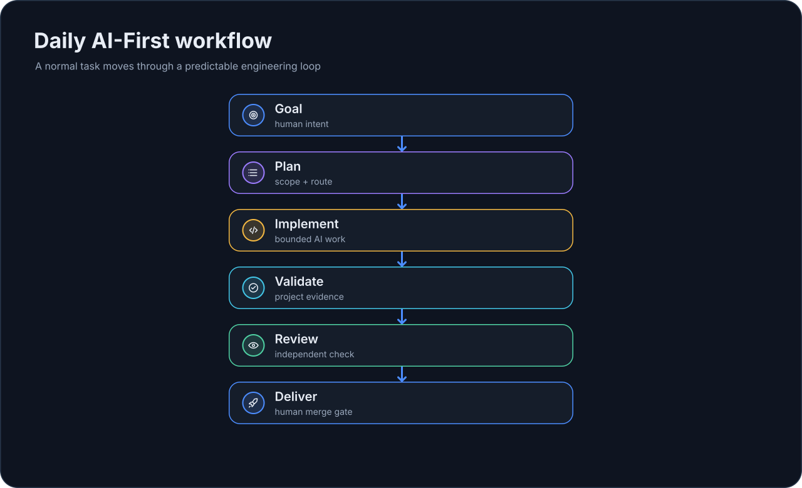

# Ежедневный процесс

EmbrAIon должен делать разработку с AI более дисциплинированной, **а не более церемониальной**.

!!! tip "Простыми словами"
    В большинстве случаев вы должны обсуждать продукт, а не framework.

## Обычный день

| Шаг | Что вы делаете | Что даёт EmbrAIon |
| --- | --- | --- |
| 1 | Формулируете инженерный результат | Знания проекта, policy, roles и optional routing уже закреплены за репозиторием |
| 2 | AI-хост реализует задачу | Host-native AI выполняет reasoning и использует инструменты |
| 3 | Завершаете self-review автора, обязательные тесты и CI | Проверки текущего кандидата подтверждают готовность к ревью |
| 4 | Запускаете отдельного read-only Reviewer в текущем хосте | Роутинг проекта выбирает reviewer; после исправлений повторяются проверки и подтверждается итоговый SHA |
| 5 | Делаете merge / delivery | Optional enforcement может сделать выбранные gates детерминированными |

Пример:

> Исправь retry flow и добавь regression coverage.

Обычно этого достаточно.

## Перед существенной или подозрительной работой

```bash
embraion doctor
embraion status
```

Используйте диагностику после обновлений framework, перед существенной работой или когда поведение проекта выглядит неправильным — не как обязательный ритуал перед каждым небольшим изменением.

## За кулисами

{ loading=lazy }

Контракт проекта может предоставить знания об архитектуре, правила для protected/private paths, project-specific specialists, optional model/deployment routing, validation profiles и требования к review.

## Изменения конфигурации отличаются от продуктовой работы

Это меняет AI-engineering system:

> Настрой routing так, чтобы complex architecture использовала наш проверенный deployment.

А это — обычная продуктовая задача:

> Исправь reconnect bug.

В обычной продуктовой работе AI-хост должен использовать существующий контракт проекта, а не переписывать его без необходимости.

## Валидация

```bash
embraion validation run affected
```

Если profile пустой, сначала настройте его. `skipped` не эквивалентен `passed`.

## Review и завершение

Проверьте:

- корректно ли изменилось требуемое поведение;
- прошла ли relevant validation;
- соблюдены ли protected/canonical boundaries;
- подтвердил ли независимый Reviewer точный итоговый HEAD PR после исправлений;
- явно ли указан residual risk.

Каждый PR проходит [независимое ревью внутри хоста](runs-review.md). Оно начинается после завершения реализации, self-review и обязательных проверок. Copilot Review не требуется. Новый коммит отменяет прежнее подтверждение reviewer; разрешение пользователя на merge/release остаётся отдельным.

Если установлен CI enforcement, он может сделать выбранные gates детерминированными при merge.

## После обновления EmbrAIon

```bash
pipx upgrade embraion
cd MyProject
embraion update
embraion doctor
embraion projection diff --host codex --destination .
```

Обновление конфигурации проекта не переписывает host projections молча.
