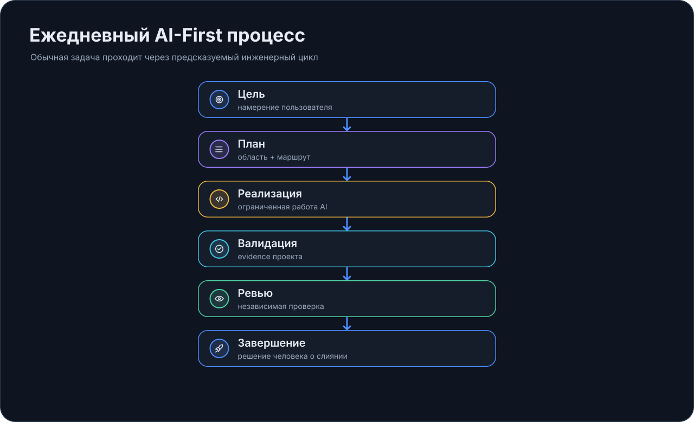

# Ежедневный процесс

EmbrAIon должен делать AI-assisted engineering более дисциплинированным, **а не более церемониальным**.

!!! tip "Простыми словами"
    В большинстве случаев вы должны обсуждать продукт, а не framework.

## Обычный день

| Шаг | Что вы делаете | Что даёт EmbrAIon |
| --- | --- | --- |
| 1 | Формулируете инженерный результат | Project knowledge, policy, roles и optional routing уже прикреплены к repo |
| 2 | Host реализует задачу | Host-native AI выполняет reasoning/tools |
| 3 | Запускаете affected validation | Реальные project commands создают evidence |
| 4 | Review существенной работы | Применяется project review policy/evidence |
| 5 | Merge/delivery | Optional enforcement может сделать выбранные gates deterministic |

Пример:

> Исправь retry flow и добавь regression coverage.

Обычно этого достаточно.

## Перед существенной или подозрительной работой

```bash
embraion doctor
embraion status
```

Используйте diagnostics после framework updates, перед substantial work или когда поведение проекта выглядит неправильно — не как обязательный ритуал перед каждым маленьким изменением.

## За кулисами

{ loading=lazy }

Project contract может предоставить architecture knowledge, protected/private path rules, project-specific specialists, optional model/deployment routing, validation profiles и review requirements.

## Изменение конфигурации отличается от продуктовой работы

Это меняет AI-engineering system:

> Настрой routing так, чтобы complex architecture использовала наш reviewed deployment.

А это — нет:

> Исправь reconnect bug.

Для обычной продуктовой работы host должен использовать существующий project contract, а не переписывать его без необходимости.

## Validation

```bash
embraion validation run affected
```

Если profile пустой, сначала настройте его. `skipped` не эквивалентен `passed`.

## Review и завершение

Проверьте:

- корректно ли изменилось требуемое поведение;
- прошла ли relevant validation;
- соблюдены ли protected/canonical boundaries;
- был ли independent review, когда он обязателен;
- явно ли указан residual risk.

Если CI enforcement установлен, выбранные gates могут стать deterministic на merge.

## После обновления EmbrAIon

```bash
pipx upgrade embraion
cd MyProject
embraion update
embraion doctor
embraion projection diff --host codex --destination .
```

Project configuration update не переписывает host projections молча.
