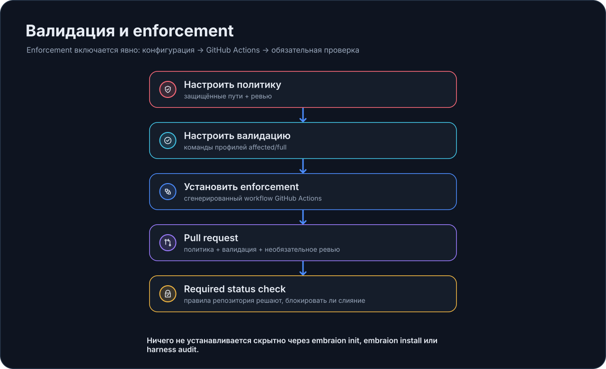

# Enforcement

EmbrAIon разделяет **project policy** и **merge-time enforcement**.

Policy может существовать без executable CI. Enforcement всегда явный и opt-in.

{ loading=lazy }

## Перед включением enforcement

Сначала убедитесь, что заслуживают доверия:

1. protected/canonical/generated/external paths в `.embraion/policy.yaml`;
2. выбранный validation profile в `.embraion/validation.yaml`;
3. review policy, если review будет обязательным.

Проверьте:

```bash
embraion doctor
embraion policy show
embraion validation list
embraion validation run affected
```

Не используйте пустой validation profile как merge gate: он вернёт `skipped`, а не `passed`.

## Статус enforcement

```bash
embraion enforcement status
```

По умолчанию enforcement выключен.

## Установите GitHub Actions surface

```bash
embraion enforcement install   --surface github-actions   --validation-profile affected
```

Чтобы также требовать текущий approved PR review:

```bash
embraion enforcement install   --surface github-actions   --validation-profile affected   --require-review
```

Команда явно создаёт:

```text
.github/workflows/embraion-enforcement.yml
```

и включает соответствующий project policy block.

Отличающийся существующий workflow не заменяется молча; intentional replacement требует `--force`.

## Что проверяет gate

Enforcement check объединяет:

- protected-source mutation detection;
- свежий executable validation profile result;
- review evidence, если настроено.

Protected detection учитывает deletions, rename sources и dot-prefixed paths.

Ручной запуск:

```bash
embraion enforcement check --base-ref origin/main
```

Со structured run evidence:

```bash
embraion enforcement check   --base-ref origin/main   --run-id task-001
```

## Сделать обязательным merge gate

Установка workflow **не меняет** branch rules автоматически.

Если GitHub должен блокировать merge при fail, настройте generated **EmbrAIon enforcement** status check как required в ruleset/branch rules.

Это намеренное разделение: repository administration остаётся явным human decision.

## Что EmbrAIon не делает молча

`embraion init`, host `install` и `harness audit` не устанавливают executable hooks или enforcement workflows.

`harness audit` сообщает доступные surfaces, но не является installer.
