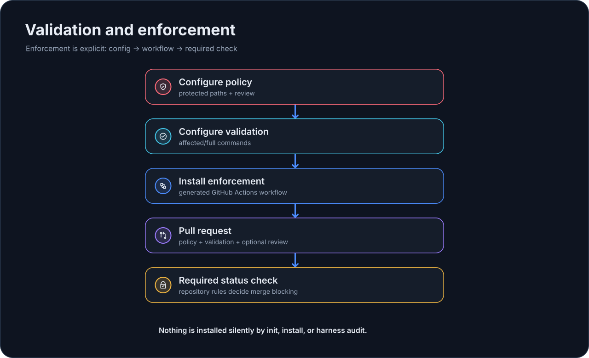

# Enforcement

EmbrAIon разделяет **политику проекта** и **enforcement при merge**.

Политика может существовать без исполняемого CI. Enforcement включается явно и только по желанию проекта.

{ loading=lazy }

## Перед включением enforcement

Сначала убедитесь, что этим настройкам можно доверять:

1. protected/canonical/generated/external paths в `.embraion/policy.yaml`;
2. выбранному validation profile в `.embraion/validation.yaml`;
3. правилам review, если review будет обязательным.

Проверьте их:

```bash
embraion doctor
embraion policy show
embraion validation list
embraion validation run affected
```

Не используйте пустой validation profile как merge gate: он вернёт `skipped`, а не `passed`.

## Проверить статус enforcement

```bash
embraion enforcement status
```

По умолчанию enforcement выключен.

## Установить механизм GitHub Actions

```bash
embraion enforcement install \
  --surface github-actions \
  --validation-profile affected
```

Чтобы дополнительно требовать актуальное одобренное review PR:

```bash
embraion enforcement install \
  --surface github-actions \
  --validation-profile affected \
  --require-review
```

Команда явно создаёт:

```text
.github/workflows/embraion-enforcement.yml
```

и включает соответствующий блок policy проекта.

Workflow устанавливает EmbrAIon через переиспользуемый action `GORYNED/EmbrAIon/actions/setup` версии, которая его создала. Во время запуска action читает project pin и устанавливает ровно эту release, проверяя digest артефакта, если pin закреплён lock, поэтому после `embraion update` workflow править не нужно. Если pin отсутствует или неточен, установка отказывает до записи файлов. См. [Consumer CI](../reference/runtime-version-resolution.ru.md#consumer-ci).

Существующий workflow с другим содержимым не заменяется молча; намеренная замена требует `--force`.

## Что проверяет gate

Enforcement check объединяет:

- обнаружение изменений protected-source;
- свежий результат исполняемого validation profile;
- evidence о review, если оно требуется.

Проверка protected paths учитывает удаления, исходные пути rename и dot-prefixed paths.

По умолчанию проверка сопоставляет **имена** изменённых файлов со списком protected из политики текущего дерева. Для более сильной защиты см. [Защита источников по идентичности объектов Git](#защита-источников-по-идентичности-объектов-git).

При необходимости запустите её вручную:

```bash
embraion enforcement check --base-ref origin/main
```

Со structured run evidence:

```bash
embraion enforcement check \
  --base-ref origin/main \
  --run-id task-001
```

## Защита источников по идентичности объектов Git

У сопоставления по именам две слабые стороны. Изменение может поправить список protected в `.embraion/policy.yaml` вместе с файлами, которые он защищает. А переименованный или перенесённый защищённый каталог больше не совпадает со старым именем.

Режим `base-tree` (включается явно) закрывает обе. Задайте его в policy:

```yaml
enforcement:
  enabled: true
  validation-profile: affected
  require-review: false
  protected-sources: base-tree
```

Или закрепите его для одного запуска независимо от политики в текущем дереве:

```bash
embraion enforcement check --base-ref origin/main --protected-sources base-tree
```

Значение по умолчанию — `name`: поведение остаётся таким, как описано выше. Любое другое значение — ошибка.

В режиме `base-tree` gate делает следующее:

1. Находит merge base командой `git merge-base <base-ref> HEAD`.
2. Читает `sources.protected` из политики **на merge base**, а не из head.
3. Требует, чтобы каждая запись base осталась в списке head. Записи можно добавлять. Удалять или сужать нельзя. Чтобы расширить запись, оставьте старую и добавьте новую рядом.
4. Для каждой записи base перечисляет подходящие пути на merge base и на HEAD через `git ls-tree` и сравнивает их по ID объектов Git: ID blob для файла, ID tree для каталога.

Почему ID объектов лучше имён: ID меняется тогда и только тогда, когда меняется содержимое, режим файла или набор записей. Переименование, подмена, удаление и добавление файла видны. Проверка только по именам ничего не видит, если имя больше не перечислено.

Любое изменение, добавление или удаление — нарушение. Есть одно исключение: **полный перенос**. Защищённый каталог можно перенести, если выполнено всё:

- запись имеет вид `<литеральный-каталог>/**`;
- под старым каталогом ничего не осталось;
- ID tree на новом месте идентичен, то есть совпадают каждый байт, имя и режим;
- каждый файл на новом месте покрыт списком protected из политики head.

Проверка «всё или ничего». Частичный перенос, перенос с одним изменённым байтом или перенос в незащищённое место — нарушение. Перенесённая запись может исчезнуть из списка head, потому что новое место должно быть в нём перечислено.

Незакоммиченные правки защищённых путей сообщаются по имени, так как их нет в HEAD. Сначала сделайте commit.

Проверка fail-closed: если решить нельзя, она не проходит. В этих случаях она завершается с сообщением:

| Сообщение начинается с | Причина |
| --- | --- |
| `Cannot resolve the base ref` | Base ref не указывает на commit. |
| `No single merge base exists` | Нет merge base. Для shallow clone сообщение просит полную историю, например `fetch-depth: 0` в CI. |
| `The merge base is a shallow-history boundary` | Merge base — граница shallow clone, настоящий неизвестен. |
| `The policy at the merge base is unreadable` | `.embraion/policy.yaml` не закоммичен на merge base. |
| `The policy at the merge base cannot be parsed` / `... has an unparsable ...` | Политика base — не корректный YAML, либо `sources.protected` — не список непустых строк. |
| `Protected entry '<entry>' was removed or narrowed` | В списке head нет записи base. |
| `Protected entry '<entry>' differs from the merge base` | Защищённый путь изменён, добавлен или удалён, либо перенос неполный. |
| `Uncommitted change to protected path` | В рабочем дереве есть незакоммиченное изменение защищённого пути. |

Запись evidence сохраняет существующую проверку `protected-sources` и добавляет `mode`, `merge-base`, `findings` и, после переноса, `relocated`.

Чтобы проект не мог выключить режим в том же изменении, используйте флаг `--protected-sources` в CI. `embraion enforcement install` сохраняет режим, уже заданный в policy.

## Сделать gate обязательным для merge

Установка workflow **не меняет** branch rules репозитория автоматически.

Если GitHub должен блокировать merge при провале gate, настройте сгенерированный status check **EmbrAIon enforcement** как required в ruleset или branch rules репозитория.

Это разделение намеренное: администрирование репозитория остаётся явным решением человека.

## Что EmbrAIon не делает молча

`embraion init`, host `install` и `harness audit` не устанавливают исполняемые hooks или enforcement workflows без явного запроса.

`harness audit` сообщает о доступных surfaces, но не устанавливает их.
