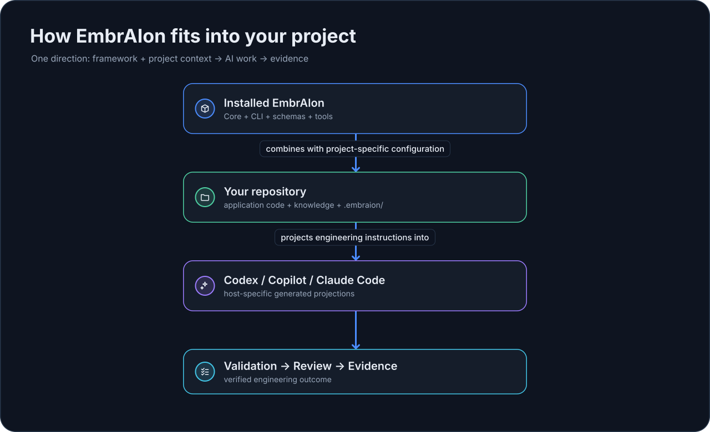

# EmbrAIon


<div class="embraion-lead" markdown>

**EmbrAIon хранит все важные правила AI-разработки в одном контракте, принадлежащем репозиторию: знания, защищённые пути, routing, validation, review и evidence — вместо того, чтобы размазывать их по промптам и настройкам AI-клиентов.**

</div>

## Когда это нужно

EmbrAIon становится полезен, когда:

- правила проекта уже не помещаются в один prompt;
- несколько AI-клиентов должны следовать одним правилам репозитория;
- protected paths и validation нужны как реальные проверки, а не только инструкции;
- архитектурные знания должны переживать новые сессии и смену моделей;
- model/routing/review решения должны быть повторно используемыми настройками проекта.

> **Ментальная модель:** EmbrAIon — операционная система AI-разработки, а `.embraion/` — Settings конкретного репозитория.

## До / после

| До | После |
| --- | --- |
| Правила живут в prompt'ах, `AGENTS.md`, настройках host, CI и памяти людей | У правил проекта есть одно каноническое место в `.embraion/` |
| Настройки разных AI-клиентов могут расходиться | Общее поведение проецируется в поддерживаемые hosts |
| «Запусти тесты» — просто инструкция | Validation profiles запускают реальные команды проекта |
| «Не трогай этот путь» может быть только текстом | Policy + validation/enforcement могут отклонить изменение protected path |
| Модель каждый раз выбирается вручную | Стабильные классы задач/риска могут использовать host default или project overrides |

## Выберите свой путь

<div class="grid cards" markdown>

-   :material-rocket-launch-outline:{ .lg .middle } **Я просто хочу, чтобы AI следовал правилам проекта**

    ---

    Прочитайте обзор за минуту, попробуйте песочницу, установите EmbrAIon и дальше ставьте AI обычные инженерные задачи.

    [EmbrAIon за 60 секунд](getting-started/in-60-seconds.md)

-   :material-console-line:{ .lg .middle } **Я хочу понять инженерную модель**

    ---

    Разберитесь с ownership, projections, routing, execution, validation, evidence и enforcement.

    [Инженерная модель](reference/engineering-model.md)

</div>

## Быстрый старт

```bash
pipx install embraion

cd MyProject
embraion init
embraion install --host codex --destination .
embraion doctor
```

После этого откройте репозиторий в своём AI-клиенте и сформулируйте инженерный результат:

> Исправь retry flow и добавь regression coverage.

Если используется другой host, замените `codex` на `copilot` или `claude-code`.

Не хотите пока трогать рабочий репозиторий? [Попробуйте песочницу за пять минут](getting-started/playground.md).

## Как это вписывается в проект

{ loading=lazy }

!!! tip "Простыми словами"
    Вы по-прежнему общаетесь напрямую с Codex, Copilot или Claude Code. EmbrAIon даёт выбранному host общий инженерный контракт репозитория и реальные команды для validation, enforcement и других детерминированных проверок.

## Почему недостаточно обычного файла инструкций?

Native-инструкции остаются полезными. EmbrAIon добавляет то, что должно быть общим, версионируемым и исполняемым.

| Native instruction file | EmbrAIon |
| --- | --- |
| В основном текстовые инструкции для конкретного host | Общий контракт проекта, проецируемый в поддерживаемые hosts |
| Легко дублировать и получить drift | Канонические настройки, принадлежащие проекту |
| Validation живёт отдельно или ad hoc | Исполняемые validation profiles + evidence |
| Нет общей routing-терминологии | Стабильные классы задач/риска |
| Merge checks настраиваются отдельно | Опциональный enforcement protected paths / validation / review |

## Дальше

- [Зачем нужен EmbrAIon?](getting-started/what-is-embraion.md)
- [EmbrAIon за 60 секунд](getting-started/in-60-seconds.md)
- [Песочница за пять минут](getting-started/playground.md)
- [Установка](getting-started/installation.md)
- [FAQ](faq.md) — прямые ответы на частые концептуальные вопросы.
- [Глоссарий](glossary.md) — короткие определения терминов EmbrAIon.
