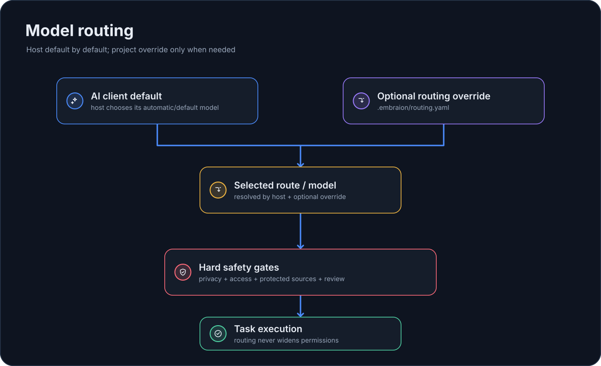

# Маршрутизация

Routing EmbrAIon model-agnostic.

Он классифицирует **работу и риск**, а не силу модели, цену, provider или marketing tier. Model availability меняется быстро; project architecture и safety constraints — значительно медленнее.

{ loading=lazy }

## Поток assignment для разных хостов

```text
Задача пользователя → декомпозиция Lead → delegated assignment
  → независимая классификация assignment → project route resolution
  → проверка active host surface capability → native model/effort application
  → execution evidence → validation/review → Lead integration
```

Role != Route != Model. Каждое новое или повторно используемое assignment оценивается по фактическим scope, role, data class, access и owned paths. Message tool без поддержки изменения settings не может менять их при reuse. Host-default не требует явного mapping и поддерживает delegation. Explicit selection требует evidence native application; неизвестные fields, скрытые inheritance, substitution и capping не удовлетворяют обязательному route.

| Поверхность | Native settings и ограничения |
| --- | --- |
| Codex verified spawn schema | Отдельные role/model/effort; explicit overrides требуют bounded или no-history fork; loaded role definitions могут перекрывать spawn |
| Copilot CLI | Definition model/ordered models, policy и effort; per-call fields требуют installed-schema proof; Auto и precedence могут приводить к inheritance |
| Copilot VS Code | Per-call/definition model; effort требует installed-version/schema proof; parent cost tier может ограничивать выбор |
| Copilot cloud/general | Definition model подтверждён; CLI-only policy/effort/list controls не предполагаются |
| Claude Code | Per-call model при проверенной поддержке; explicit effort через loaded assignment-specific definition или supported handoff, без выдуманного Agent effort field |
| Portable | Только contract/capability metadata; нет spawn или model runtime |

См. [AI-хосты](hosts/index.md): precedence и effective-setting checks. Неподдерживаемые обязательные settings требуют capability limitation до dispatch или supported handoff; смена хоста требует новой privacy/access проверки. Prepared plan содержит `executed: false` и не доказывает выполнение.

Обычный [Project Bootstrap](configuration/bootstrap.md) сохраняет необязательность routing. Полный/tuned bootstrap запрашивайте для намеренного выбора project-owned deployments и routes.

## Route classes

Канонические route classes:

| Route class | Значение |
| --- | --- |
| `bounded-read` | Узкое read-only discovery или research |
| `bounded-write` | Механическое или жёстко ограниченное writable изменение |
| `ordinary` | Ограниченная обычная инженерная работа |
| `substantial` | Существенная инженерная работа и стандартный review |
| `complex` | Cross-domain, lifecycle, concurrency или сложный review |
| `critical` | Исключительный protected-decision risk |

`critical` требует конкретного исключительного риска: необратимой миграции или удаления сохранённых пользовательских данных, пути к потере данных или сбою восстановления, системного раскрытия credentials, прав или другой угрозы безопасности, либо breaking public contract с versioned migration. Размер, широта или недоступность более дешёвого deployment сами по себе не делают работу critical.

Это стабильный framework vocabulary. Класс не означает, что одна конкретная модель навсегда является «complex model» или «critical model».

Routing оценивается вместе с независимыми dimensions:

- role;
- data class;
- access mode;
- owned paths;
- project deployment capabilities;
- validation/review requirements.

## Поведение по умолчанию

Без project override routing разрешается как `host-default`. Host отвечает за доступные модели и automatic/default model policy.

```bash
embraion route --host codex --route-class substantial --data PRIVATE
```

Default result не содержит framework-selected model:

```json
{
  "host": "codex",
  "route": "substantial",
  "role": null,
  "resolution": "host-default",
  "model": null,
  "effort": null,
  "options": {},
  "data": "PRIVATE"
}
```

Новые модели могут появляться в host без новой release EmbrAIon.

## Optional project overrides

Проект может объявить reusable choices в `.embraion/deployments.yaml` и сослаться на них из `.embraion/routing.yaml`:

```yaml
# .embraion/deployments.yaml
providers:
  example:
    display-name: Example Provider

deployments:
  complex-main:
    host: codex
    provider: example
    model: any-host-model-selector
    efforts: [medium, high]
    default-effort: high
```

```yaml
# .embraion/routing.yaml
overrides:
  codex:
    routes:
      complex:
        deployment: complex-main
        effort: high
    roles:
      reviewer:
        deployment: complex-main
```

Registry project-owned, а не Core model catalog. Model/provider strings намеренно open-ended.

Для простых choices поддерживаются direct `model`, `effort`, `options` overrides.

Resolution precedence:

1. role override, если role передана;
2. route override;
3. host default/automatic selection.

Role override merge поверх route override и может заменить только нужные поля.

## Project task classes и effective routes

Проект задаёт semantic task classes в `.embraion/routing.yaml`: Core route class, роль, минимальный data class и упорядоченные host candidates. Candidate использует override выбранного host, ссылается на deployment или раскрывает project candidate group. Task-class override имеет приоритет над сочетанием route/role, затем role и route. Команда `embraion route --task-class <class>` возвращает выбранный deployment, availability candidates, отдельные escalation routes и provenance. `embraion route --validate` проверяет конфигурацию; `embraion route --audit-authority` ищет дубли concrete facts вне `.embraion/**`.

Availability fallback не повышает complexity. Переход на другой host требует новой privacy/access проверки и handoff. Quality/critical escalation требует явных `--escalation` и `--justification`; critical escalation указывает route class `critical`, и любой выбранный critical route требует justification. Каждый re-review — новое bounded assignment с классификацией фактического delta: узкая проверка исправления может быть `substantial`, но изменения concurrency, lifecycle, compatibility или architecture semantics остаются `complex`.

`.embraion/**` — единственный manually maintained authority для concrete provider/model/deployment/effort/routing/fallback, deployment capabilities, billing, pricing/SKU и execution bindings. В `.embraion/execution.yaml` хранятся ссылки на credentials, не значения secrets. Consumer tests/docs проверяют semantic classes через resolved EmbrAIon configuration. Generated host projections являются производными outputs.

## Routing не является provider execution

Routing отвечает на вопрос **что выбрать**, но сам не создаёт provider call.

Для host-native work AI host использует resolved project contract и сам выполняет execution.

При делегировании в Codex Lead независимо классифицирует конкретное задание и перед native spawn запрашивает `embraion route` с его role, route class, data class и access mode либо configured task class. Complexity предыдущего задания и название роли не выбирают модель. Явные resolved model/effort передаются через поддерживаемые native spawn parameters; `host-default` использует host subagent defaults или inheritance.

Codex adapter не записывает model/effort в generated specialist files: Codex role-file overrides имеют приоритет над явным spawn choice. Config merge сохраняет пользовательские `default_subagent_model` и `default_subagent_reasoning_effort` как host defaults. EmbrAIon-managed concrete assignment choices остаются в `.embraion/**`; generated files не становятся вторым authority. См. официальные [config reference](https://learn.chatgpt.com/docs/config-file/config-reference) и [subagent configuration](https://learn.chatgpt.com/docs/agent-configuration/subagents).

Static TOML не может обращаться к resolver перед каждым spawn. Projected Lead instructions направляют host к этому шагу; trust, permissions, инструкции более высокого приоритета и native capabilities сохраняют силу. Если обязательный explicit choice нельзя применить, Lead сообщает об ограничении и разрешает его до dispatch, а не заявляет об успешном применении. Cross-host routes требуют явного handoff и новой privacy/access проверки. Role, access, route class, host и model selection остаются независимыми.

Для `embraion execute` выбранный deployment должен иметь approved `.embraion/execution.yaml` binding. Runtime выполняет bounded candidate list и eligible fallback в исходных request ceilings.

См. [Как работает EmbrAIon](getting-started/how-it-works.md) и [Execution и провайдеры](configuration/execution.md).

## AI-First configuration

Каждая installed host projection содержит reusable `routing-configuration` skill. Он объясняет AI, что routing overrides принадлежат `.embraion/routing.yaml`, а не generated host files или arbitrary docs.

Ожидаемый UX — conversational:

> Настрой EmbrAIon routing для репозитория, используя реально доступные модели. Оставь host-default там, где explicit choice не нужен. Model, effort и host-specific overrides записывай только в project routing/deployment configuration. Не ослабляй privacy, access, ownership, validation или review policy.

AI должен менять только project-owned configuration и проверять affected routes.

## Что валидирует EmbrAIon

Детерминированно проверяются:

- route-class и data-class names;
- project-override structure;
- role/route precedence;
- deployment existence/enabled state;
- host matching;
- supported effort;
- declared data/role/access/task capabilities;
- access/privacy policy независимо от model identity.

Execution host остаётся authoritative в вопросе, доступен ли opaque selector/options текущему аккаунту.

## Host-specific setup

См. [Разговорную настройку](configuration/ai-hosts.md) для Codex, GitHub Copilot и Claude Code.
