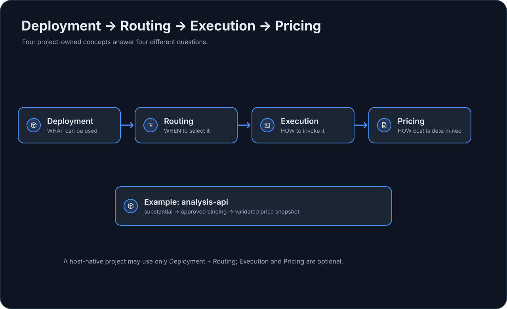

# Инженерная модель

Эта страница описывает точную инженерную модель, которая стоит за упрощённым Getting Started flow.

## Инструкции хоста и детерминированные механизмы

| Механизм | Значение | Кто выполняет |
| --- | --- | --- |
| Сгенерированные agents / skills | Host-native инструкции и процедуры | AI-хост |
| `embraion route` | Разрешает routing policy | EmbrAIon CLI |
| `embraion dispatch` | Строит ограниченный план | EmbrAIon CLI |
| Host-native edits/search/tools | Фактическая инженерная работа | AI-хост |
| `embraion execute` | Ограниченный provider-neutral запрос | EmbrAIon runtime |
| `embraion validation run` | Реальные команды проекта + evidence | EmbrAIon CLI + команды проекта |
| `embraion enforcement check` | Gate для protected paths / validation / review | EmbrAIon CLI |
| GitHub enforcement workflow | CI-механизм при merge | GitHub Actions |

Доставка инструкций и детерминированный enforcement — разные механизмы.

## Владение: EmbrAIon Core и проект

| EmbrAIon Core отвечает за | Проект отвечает за |
| --- | --- |
| общие roles и skills | знания об архитектуре и предметной области |
| contracts для route/execution | deployments и routing preferences |
| общие privacy/security-механизмы | protected paths и policy проекта |
| механизмы validation/review | реальные validation commands |
| поведение host projections | project-specific agents |
| provider-neutral fallback/health | execution bindings и источники pricing |

## Deployment → Routing → Execution → Pricing

| Понятие | Вопрос | Файл проекта |
| --- | --- | --- |
| Deployment | **Что** за повторно используемый конкретный вариант существует? | `.embraion/deployments.yaml` |
| Routing | **Когда** route/role должна его выбирать? | `.embraion/routing.yaml` |
| Execution binding | **Как** его можно безопасно вызвать? | `.embraion/execution.yaml` |
| Pricing | **Как** определяется и обновляется стоимость? | `.embraion/pricing.yaml` |

{ loading=lazy }

## Классы маршрутов

| Route | Значение |
| --- | --- |
| `bounded-read` | узкое read-only исследование |
| `bounded-write` | механическая или жёстко ограниченная работа с записью |
| `ordinary` | ограниченная обычная инженерная задача |
| `substantial` | существенная инженерная работа + стандартное review |
| `complex` | кросс-доменная работа, lifecycle/concurrency или сложное review |
| `critical` | исключительный риск для защищённых решений |

Route classes описывают работу и риск, а не постоянные model tiers.

## Host-native и provider-neutral execution

### Host-native

AI-хост отвечает за reasoning и инструменты. EmbrAIon предоставляет knowledge/policy/roles/routing проекта, а также contracts для validation и review.

### Provider-neutral

`embraion execute` отвечает за ограниченный внешний/API-путь через явные bindings проекта. Он может нормализовать ошибки/health и применять допустимый fallback, не расширяя исходные ограничения запроса.

Deployment, доступный для routing, не становится автоматически executable: без binding runtime может вернуть `handoff-required`.

## Evidence и критерии принятия

Успешное выполнение provider-запроса ещё не означает корректность проекта. Проект всё равно может требовать детерминированную validation, project-specific acceptance, независимое review и решение человека о merge.

## Связанные страницы

- [Как работает EmbrAIon](../getting-started/how-it-works.md)
- [Настройка проекта](../configuration/index.md)
- [Model Routing](../model-routing.md)
- [Execution и провайдеры](../configuration/execution.md)
- [Pricing и стоимость](../configuration/pricing.md)
- [Валидация и evidence](../validation.md)
