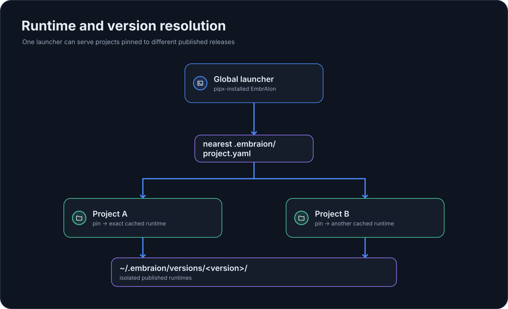

# Runtime и разрешение версий

EmbrAIon разделяет **версию глобального launcher** и **release framework, закреплённый за каждым проектом**.

## Один launcher, несколько project pins

Проект хранит framework contract в:

```text
.embraion/project.yaml
```

Начиная с v0.14 project pin может включать точную identity опубликованного wheel и его проверенный SHA-256 digest:

```yaml
framework:
  repository: GORYNED/EmbrAIon
  version: 0.16.0
  artifact:
    schema: 1
    source: github-release
    release: v0.16.0
    asset: embraion-0.16.0-py3-none-any.whl
    digest: sha256:<64-lowercase-hex>
```

Artifact lock принадлежит самому framework. Consumer CI больше не нужен отдельный URL wheel, вручную захардкоженная переменная checksum или собственный parser checksum.

Старые manifests, где есть только version, остаются валидными. Следующий успешный `embraion update` автоматически обновит их и создаст lock; ручная миграция не требуется.

Обычные команды находят ближайший проект и разрешают его pin:

{ loading=lazy }

Если pin отличается от версии launcher, EmbrAIon устанавливает точно закреплённую distribution в изолированный cache:

```text
~/.embraion/versions/<version>/
```

Для проектов с lock runtime resolver скачивает точный asset из canonical GitHub Release, проверяет SHA-256 **до** установки через pip и записывает artifact identity в runtime marker. Cached runtime можно повторно использовать только когда его artifact identity и digest совпадают с project lock.

Поэтому разные репозитории на одной машине могут оставаться на разных release-версиях EmbrAIon.

## Update, verify, install

Сначала обновите global launcher, затем проект:

```bash
pipx upgrade embraion
cd MyProject
embraion update
```

`embraion update` ориентируется на установленную версию launcher. До изменения project pin команда разрешает canonical GitHub Release, требует ровно один ожидаемый wheel asset, требует server-side GitHub digest формата `sha256:`, проверяет release tag / имя asset / URL и валидирует candidate project configuration.

Запись manifest является commit point обновления: `framework.version` и `framework.artifact` заменяются вместе одной атомарной записью YAML. Отсутствующий release, отсутствующий artifact, некорректный digest или несовместимая конфигурация приводят к fail-closed до изменения pin.

Проверить закреплённый release artifact без установки:

```bash
embraion framework verify
```

Установить точный release с проверенным digest в изолированный runtime cache:

```bash
embraion framework install
```

Обе команды берут artifact identity только из project pin/lock. Consumer-owned checksum logic им не нужна.

## Consumer CI

Workflow GitHub Actions может использовать переиспользуемый setup action вместо собственного шага установки и чтения pin:

```yaml
steps:
  - uses: actions/checkout@v4
    with:
      fetch-depth: 0  # история для --base-ref
  - uses: GORYNED/EmbrAIon/actions/setup@v<release>
    with:
      python-version: "3.13"  # необязательно, значение по умолчанию
      project-path: .         # необязательно, папка в корне проекта или ниже
  - uses: GORYNED/EmbrAIon/actions/check@v<release>
```

Action `check` выполняет `embraion framework install` для pin с lock, а затем `embraion check`, поэтому в workflow нет флагов проекта: режимы organization check, порог security и область сканирования берутся из секции `check` в `.embraion/policy.yaml` (см. [Параметры check](../configuration/policy.md#check-options)). Входы: `project-path` (по умолчанию `.`) и `base-ref`. Без `base-ref` на pull request сравнение идёт с `origin/<base branch>`; в других событиях проверки, которым нужен base ref, отмечаются как не запущенные. Action ожидает, что EmbrAIon уже установлен setup action, и входа `python-version` не имеет. `embraion check` запускает все проверки, которые выбирает конфигурация проекта; см. [справочник CLI](cli.md#embraion-check).

Action настраивает Python, читает `.embraion/project.yaml` тем же кодом, что и `embraion framework pin`, и устанавливает ровно закреплённую release. При artifact lock он скачивает canonical release wheel и проверяет SHA-256 до установки через pip; без lock устанавливает `embraion==<version>`. Затем проверяется установленная версия. Отсутствующий или неточный pin, несовпадающий lock или несовпадение digest завершают шаг с ошибкой. Outputs: `version` и `digest` (пустой без lock).

Ref action выбирает только код начальной установки. Устанавливаемая release всегда берётся из project pin, поэтому `embraion update` действует без правки workflow; ref стоит менять только ради нового поведения самого action. Чтение pin выполняется кодом release action в изолированном окружении только с PyYAML, а текст проекта не может выполнить workflow commands в логе. Шаги используют `bash` и рассчитаны на Linux и macOS runners; Windows runners не поддерживаются. Команды в проекте с lock по-прежнему выполняются из runtime cache, привязанного к digest, как описано выше.

Другие CI-системы могут следовать тому же контракту: `embraion framework pin` печатает строки `version=` и `digest=` и завершается с ошибкой при неточном pin. `embraion enforcement install` генерирует workflow с этим action.

## Проверить разрешённую версию

```bash
embraion status
embraion status --json
```

Status показывает launcher, project pin, resolved runtime, состояние cache, а также наличие artifact lock и его digest.

## Управление cache

```bash
embraion cache list
```

Предварительный просмотр очистки:

```bash
embraion cache prune --older-than 90
```

Применить очистку осознанно:

```bash
embraion cache prune --older-than 90 --apply
```

Активный launcher и resolved runtime текущего проекта защищены от очистки по возрасту.

## Переход на другую конкретную release

Сначала установите нужную версию launcher, затем запустите `embraion update` из проекта. Нормализация конфигурации и генерация artifact lock принадлежат тому же release contract, который будет записан.

## Development override

`EMBRAION_HOME` выбирает явный checkout framework для разработки самого EmbrAIon. Автоматическое разрешение версий можно намеренно отключить через `EMBRAION_DISABLE_VERSION_RESOLUTION=1`.

Переменные resolver `EMBRAION_VERSION_RESOLVED`, `EMBRAION_RESOLVED_VERSION`, `EMBRAION_RESOLVED_PROJECT` и установленный им `EMBRAION_HOME` действуют только в делегированном интерпретаторе. Validation и другие независимые дочерние команды получают очищенное окружение и разрешают собственный project. Явный development override пользователя сохраняется. Установка, проверка и запуск cached runtime также исключают `PYTHONPATH`, чтобы импорты из checkout не подменяли locked distribution.

Репозиторий framework сам является EmbrAIon project. Его pin и artifact lock остаются на последнем опубликованном стабильном релизе, пока source развивается. В checkout используйте `python tools/source.py <command>` для source CLI и `python tools/source.py test unit` или `test integration` для source tests. Runner выбирает код и данные checkout, удаляет унаследованное состояние resolver и использует локальную `.venv`, если она существует; иначе текущий Python должен иметь зависимости framework. Source CLI сохраняет project overlay и routing репозитория. Validation profiles и source CI используют этот entry point; проверки installed package вне checkout продолжают использовать packaged CLI.
