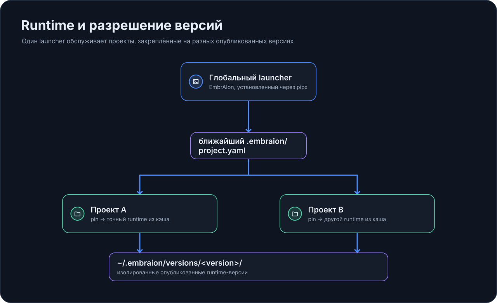

# Runtime и разрешение версий

EmbrAIon разделяет **версию глобального launcher** и **framework version, закреплённую каждым project**.

## Один launcher, несколько project pins

Проект хранит exact framework release в:

```text
.embraion/project.yaml
```

```yaml
framework:
  repository: GORYNED/EmbrAIon
  version: <published-version>
```

Обычные команды находят ближайший project и разрешают его pin:

{ loading=lazy }

Если pin отличается от launcher version, EmbrAIon может установить exact published distribution в isolated cache:

```text
~/.embraion/versions/<version>/
```

Поэтому разные repos могут оставаться на разных releases EmbrAIon на одной машине.

## Посмотреть resolution

```bash
embraion status
embraion status --json
```

Status показывает launcher, project pin, resolved runtime, cache state и detected host projections.

## Cache management

```bash
embraion cache list
embraion cache prune --older-than 90
embraion cache prune --older-than 90 --apply
```

Первый prune — dry run. Active launcher и current project's runtime защищены от age-based pruning.

## Обновление проекта

Safe sequence:

```bash
pipx upgrade embraion
cd MyProject
embraion update
embraion doctor
```

`embraion update` launcher-owned. Safe normalization целится только в **installed launcher version**, чтобы runtime не угадывал schema/defaults другой release.

Update может добавить compatible missing defaults и изменить project pin, сохраняя project-owned values. Все candidate canonical `.embraion/` files валидируются до записи.

Host projections не обновляются молча.

## Переход на другую конкретную release

Сначала установите эту launcher version, затем `embraion update`. Так configuration normalization принадлежит тому же release contract, который записывается.

## Development override

`EMBRAION_HOME` выбирает explicit framework checkout для framework development. Automatic resolution можно отключить через `EMBRAION_DISABLE_VERSION_RESOLUTION=1`.
