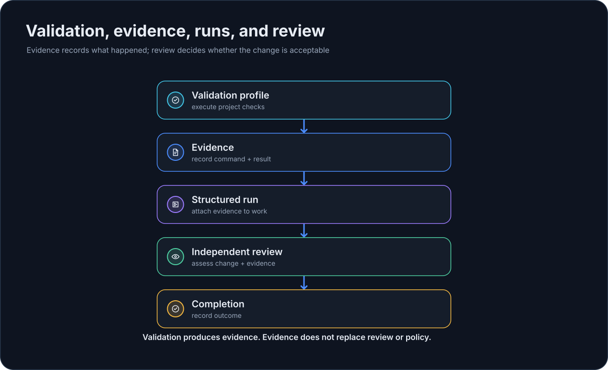

# Validation & Evidence

EmbrAIon has two related but different validation concepts.

{ loading=lazy }

## Framework validation

```bash
embraion validate
```

This validates the installed EmbrAIon framework itself: schemas, catalogs, references, localization contracts, and other deterministic framework invariants.

Use it when verifying the EmbrAIon installation or developing the framework.

## Project validation profiles

Consuming repositories define executable commands in `.embraion/validation.yaml` and run them with:

```bash
embraion validation run <profile>
```

Configure profiles first: [Validation Profiles](configuration/validation.md).

Inspect available project profiles:

```bash
embraion validation list
```

Run fresh evidence:

```bash
embraion validation run fast
embraion validation run affected --json
embraion validation run full --run-id task-001
```

## Evidence behavior

Commands execute sequentially from the project root. Each result records:

- profile and overall status;
- command identity;
- exit code;
- duration;
- redacted stdout/stderr tails;
- optional attached execution run;
- evidence ID/path.

Evidence is stored under:

```text
.embraion/state/validation/
```

That is local runtime state and is ignored by the project-local `.gitignore`.

An empty profile reports `skipped`. A failed or timed-out command makes the profile fail. Use `--fail-fast` only when later commands are not useful after the first failure.

## Validation is evidence, not a policy override

A green test result cannot override a failed privacy, permission, protected-path, compatibility, or security gate.

Likewise, behavioral eval improvement does not turn a deterministic safety failure into a pass.

## Attach evidence to a structured run

```bash
embraion validation run affected --run-id task-001
```

The run must be active. The validation record is attached by evidence ID rather than re-entered as an unverified claim.

See [Runs & Review](guides/runs-review.md) and [Enforcement](guides/enforcement.md).
