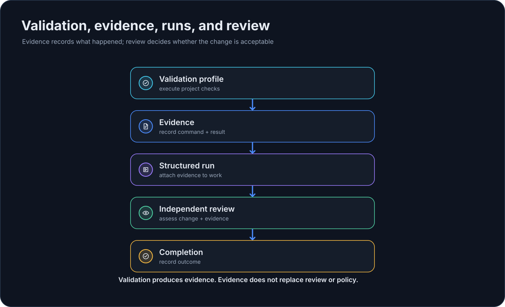

# Валидация и evidence

В EmbrAIon есть два связанных, но разных понятия validation.

{ loading=lazy }

## Framework validation

```bash
embraion validate
```

Эта команда валидирует сам установленный framework EmbrAIon: schemas, catalogs, references, localization contracts и другие deterministic framework invariants.

Используйте при проверке установки EmbrAIon или разработке framework.

## Project validation profiles

Consuming repositories определяют executable commands в `.embraion/validation.yaml` и запускают:

```bash
embraion validation run <profile>
```

Сначала настройте profiles: [Настройка validation](configuration/validation.md).

Посмотреть profiles:

```bash
embraion validation list
```

Создать свежее evidence:

```bash
embraion validation run fast
embraion validation run affected --json
embraion validation run full --run-id task-001
```

## Поведение evidence

Commands выполняются последовательно из project root. Каждый result записывает:

- profile и overall status;
- command identity;
- exit code;
- duration;
- redacted stdout/stderr tails;
- optional attached execution run;
- evidence ID/path.

Evidence хранится в:

```text
.embraion/state/validation/
```

Это local runtime state, игнорируемый project-local `.gitignore`.

Empty profile возвращает `skipped`. Failed/timed-out command делает profile failed. `--fail-fast` используйте только когда дальнейшие commands бессмысленны.

## Validation — evidence, а не обход policy

Green test result не может отменить failed privacy, permission, protected-path, compatibility или security gate.

Так же behavioral eval improvement не превращает deterministic safety failure в pass.

## Прикрепить evidence к structured run

```bash
embraion validation run affected --run-id task-001
```

Run должен быть active. Validation record прикрепляется по evidence ID вместо повторного ввода неподтверждённого claim.

См. [Runs и review](guides/runs-review.md) и [Enforcement](guides/enforcement.md).
